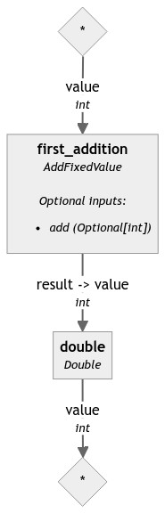

# Hayhooks

[](https://pypi.org/project/hayhooks)
[](https://pypi.org/project/hayhooks)
[](https://github.com/deepset-ai/hayhooks/actions/workflows/docker.yml)
[](https://github.com/deepset-ai/hayhooks/actions/workflows/tests.yml)
-----

**Table of Contents**

- [Hayhooks](#hayhooks)
  - [Quick start](#quick-start)
    - [Install the package](#install-the-package)
    - [Check Hayhooks status](#check-hayhooks-status)
    - [Deploy a Haystack pipeline](#deploy-a-haystack-pipeline)
    - [Have a look at the API schema](#have-a-look-at-the-api-schema)
    - [Run the pipeline](#run-the-pipeline)
    - [Undeploy the pipeline](#undeploy-the-pipeline)
  - [Docker setup](#docker-setup)
  - [Next steps](#next-steps)
  - [License](#license)

## Quick start

### Install the package

Start by installing the package:

```console
pip install hayhooks
```

The `hayhooks` package ships both the server and the client component, and the client is capable of starting the
server. From a shell, start the server with:

```console
$ hayhooks run
INFO:     Started server process [44782]
INFO:     Waiting for application startup.
INFO:     Application startup complete.
INFO:     Uvicorn running on http://localhost:1416 (Press CTRL+C to quit)
```
### Check Hayhooks status

From a different shell, you can query the status of the server with:

```console
$ hayhooks status
Hayhooks server is up and running.
```
### Deploy a Haystack pipeline

Time to deploy a Haystack pipeline. The pipeline must be in Yaml format (the output of [`pipeline.dump()`](https://docs.haystack.deepset.ai/v2.0/docs/serialization#converting-a-pipeline-to-yaml)), if you don't have one at hand, you can use
one from this repository. From the root of the repo:

```console
$ hayhooks deploy tests/test_files/test_pipeline_01.yml
Pipeline successfully deployed with name: test_pipeline_01
```

Another call to `status` should confirm your pipeline is ready to serve requests:

```console
$ hayhooks status
Hayhooks server is up and running.

Pipelines deployed:
- test_pipeline_01
```

### Have a look at the API schema

Hayhooks will use introspection to set up the OpenAPI schema accordingly to the inputs and outputs of your pipeline,
and to see how this works let's get the pipeline diagram with:

```console
$ curl http://localhost:1416/draw/test_pipeline_01 --output test_pipeline_01.png
```

The downloaded image should look like this:



As you can see, the pipeline in order to start requires an input of type `int` named `value`, and optionally we can
pass another input of type `int` named `add`. At the end of the run, the pipeline will return an output of type `int`
named `result`.

If you open a browser at [http://localhost:1416/docs#/](http://localhost:1416/docs#/) you should see two schemas, one
for the Request, where we'll pass the pipeline inputs (note how `add` is optional):

```
Test_pipeline_01RunRequest
    first_addition
        value* integer
        add (integer | null)
```

And another one for the Response, where we'll receive the pipeline results:

```
Test_pipeline_01RunResponse
    double
        value* integer
```

### Run the pipeline

At this point, knowing the schema we can run our pipeline with an HTTP client:

```console
$ curl -X 'POST' \
  'http://localhost:1416/test_pipeline_01' \
  -H 'accept: application/json' \
  -H 'Content-Type: application/json' \
  -d '{
  "first_addition": {
    "value": 19
  }
}'

{"double":{"value":42}}%
```

### Undeploy the pipeline

Hayhooks tries to do as much bookkeeping as possible without restarting the server. For example, to free up
resources you can undeploy the pipeline directly from the client:

```console
$ hayhooks undeploy test_pipeline_01
Pipeline successfully undeployed
```

### Set a hayhooks server

To connect to a specific server you can pass a `--server` argument to the client:
```bash
$ hayhooks --server http://myserver:1416 status
```

#### Disable SSL verification

For development purposes, you can disable SSL verification with the `--disable-ssl` flag:
```bash
$ hayhooks --disable-ssl status
```

## Docker setup

> [!TIP]
> If you have docker-compose installed and you want to quickly get up and running, just do `docker-compose up -d`

Instead of launching the server in a separate shell like we did in the Quick Start, you can run it in a Docker
container :

```console
$ docker run --rm -p 1416:1416 deepset/hayhooks:main
...
```

If you want to build the container yourself:

```console
$ cd docker
$ docker buildx bake
...
```

There are 2 special folders in the container you can override using a `mount`:
1. A folder `/opt/pipelines` containing pipeline definitions that will be automatically deployed when the container starts
2. A folder `/opt/custom_components` containing custom components that Haystack will be able to import if part of a pipeline

For example, you can mount a local `./pipelines` folder containing pipelines you want to run at start-up like this:

```console
$ docker run --rm -p 1416:1416 -v $PWD/pipelines:/opt/pipelines "deepset/hayhooks:main"
```

## License

`hayhooks` is distributed under the terms of the [Apache-2.0](https://spdx.org/licenses/Apache-2.0.html) license.
