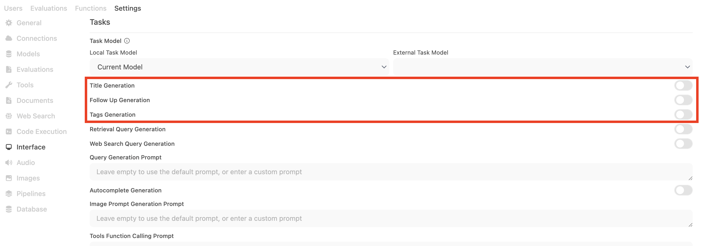
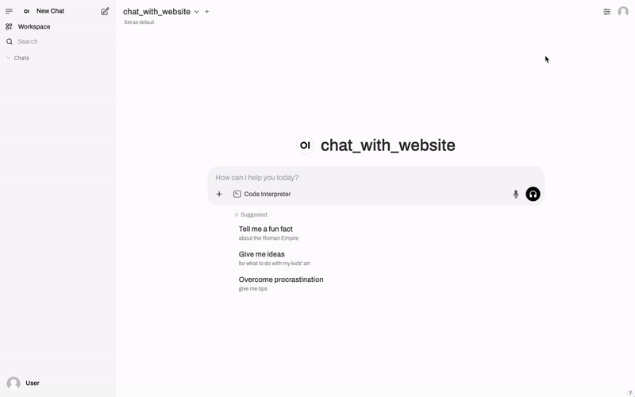

# Hayhooks

**Hayhooks** makes it easy to deploy and serve [Haystack](https://haystack.deepset.ai/) [Pipelines](https://docs.haystack.deepset.ai/docs/pipelines) and [Agents](https://docs.haystack.deepset.ai/docs/agents).

With Hayhooks, you can:

- 📦 **Deploy your Haystack pipelines and agents as REST APIs** with maximum flexibility and minimal boilerplate code.
- 🛠️ **Expose your Haystack pipelines and agents over the MCP protocol**, making them available as tools in AI dev environments like [Cursor](https://cursor.com) or [Claude Desktop](https://claude.ai/download). Under the hood, Hayhooks runs as an [MCP Server](https://modelcontextprotocol.io/docs/concepts/architecture), exposing each pipeline and agent as an [MCP Tool](https://modelcontextprotocol.io/docs/concepts/tools).
- 💬 **Integrate your Haystack pipelines and agents with [open-webui](https://openwebui.com)** as OpenAI-compatible chat completion backends with streaming support.
- 🕹️ **Control Hayhooks core API endpoints through chat** - deploy, undeploy, list, or run Haystack pipelines and agents by chatting with [Claude Desktop](https://claude.ai/download), [Cursor](https://cursor.com), or any other MCP client.

[](https://pypi.org/project/hayhooks)
[](https://pypi.org/project/hayhooks)
[](https://github.com/deepset-ai/hayhooks/actions/workflows/docker.yml)
[](https://github.com/deepset-ai/hayhooks/actions/workflows/tests.yml)

- [Quick Start with Docker Compose](#quick-start-with-docker-compose)
- [Quick Start](#quick-start)
- [Install the package](#install-the-package)
- [Configuration](#configuration)
  - [Environment Variables](#environment-variables)
  - [CORS Settings](#cors-settings)
- [Logging](#logging)
  - [Using the logger](#using-the-logger)
  - [Changing the log level](#changing-the-log-level)
- [CLI Commands](#cli-commands)
- [Start Hayhooks](#start-hayhooks)
- [Deploy a Pipeline](#deploy-a-pipeline)
  - [PipelineWrapper](#why-a-pipeline-wrapper)
  - [Setup Method](#setup)
  - [Run API Method](#run_api)
  - [Async Run API Method](#run_api_async)
  - [PipelineWrapper development with `overwrite` option](#pipelinewrapper-development-with-overwrite-option)
  - [Additional Dependencies](#additional-dependencies)
- [Deploy a YAML Pipeline](#deploy-a-yaml-pipeline)
- [Deploy an Agent](#deploy-an-agent)
- [Load pipelines or agents at startup](#load-pipelines-or-agents-at-startup)
- [Support file uploads](#support-file-uploads)
- [Run pipelines from the CLI](#run-pipelines-from-the-cli)
  - [Run a pipeline from the CLI JSON-compatible parameters](#run-a-pipeline-from-the-cli-json-compatible-parameters)
  - [Run a pipeline from the CLI uploading files](#run-a-pipeline-from-the-cli-uploading-files)
- [MCP support](#mcp-support)
  - [MCP Server](#mcp-server)
  - [Create a PipelineWrapper for exposing a Haystack pipeline as a MCP Tool](#create-a-pipelinewrapper-for-exposing-a-haystack-pipeline-as-a-mcp-tool)
  - [Expose a YAML pipeline as a MCP Tool](#expose-a-yaml-pipeline-as-a-mcp-tool)
  - [Using Hayhooks MCP Server with Claude Desktop](#using-hayhooks-mcp-server-with-claude-desktop)
  - [Using Hayhooks Core MCP Tools in IDEs like Cursor](#using-hayhooks-core-mcp-tools-in-ides-like-cursor)
  - [Development and deployment of Haystack pipelines directly from Cursor](#development-and-deployment-of-haystack-pipelines-directly-from-cursor)
  - [Skip MCP Tool listing](#skip-mcp-tool-listing)
- [Hayhooks as an OpenAPI Tool Server in `open-webui`](#hayhooks-as-an-openapi-tool-server-in-open-webui)
  - [Example: Deploy a Haystack pipeline from `open-webui` chat interface](#example-deploy-a-haystack-pipeline-from-open-webui-chat-interface)
- [OpenAI Compatibility and `open-webui` integration](#openai-compatibility-and-open-webui-integration)
  - [OpenAI-compatible endpoints generation](#openai-compatible-endpoints-generation)
  - [Using Hayhooks as `open-webui` backend](#using-hayhooks-as-open-webui-backend)
  - [Run Chat Completion Method](#run_chat_completion)
  - [Async Run Chat Completion Method](#run_chat_completion_async)
  - [Streaming Responses](#streaming-responses-in-openai-compatible-endpoints)
    - [Async Streaming Generator](#async_streaming_generator)
    - [Integration with Haystack OpenAIChatGenerator](#integration-with-haystack-openaichatgenerator)
- [Sending `open-webui` events enhancing the user experience](#sending-open-webui-events-enhancing-the-user-experience)
- [Hooks](#hooks)
  - [Intercepting tool calls when using `open-webui` and streaming responses](#intercepting-tool-calls-when-using-open-webui-and-streaming-responses)
- [Advanced Usage](#advanced-usage)
  - [Run Hayhooks Programmatically](#run-hayhooks-programmatically)
  - [Sharing code between pipeline wrappers](#sharing-code-between-pipeline-wrappers)
- [Deployment Guidelines](#deployment-guidelines)
- [License](#license)

## Quick start with Docker Compose

To quickly get started with Hayhooks, we provide a ready-to-use Docker Compose 🐳 setup with pre-configured integration with [open-webui](https://openwebui.com/).

It's available in the [Hayhooks + Open WebUI Docker Compose repository](https://github.com/deepset-ai/hayhooks-open-webui-docker-compose).

## Quick start

### Install the package

Start by installing the package:

```shell
pip install hayhooks
```

If you want to use the [MCP Server](#mcp-server), you need to install the `hayhooks[mcp]` package:

```shell
pip install hayhooks[mcp]
```

**NOTE: You'll need to run at least Python 3.10+ to use the MCP Server.**

### Configuration

Currently, you can configure Hayhooks by:

- Set the environment variables in an `.env` file in the root of your project.
- Pass the supported arguments and options to `hayhooks run` command.
- Pass the environment variables to the `hayhooks` command.

#### Environment variables

The following environment variables are supported:

- `HAYHOOKS_HOST`: The host on which the server will listen.
- `HAYHOOKS_PORT`: The port on which the server will listen.
- `HAYHOOKS_MCP_PORT`: The port on which the MCP Server will listen.
- `HAYHOOKS_MCP_HOST`: The host on which the MCP Server will listen.
- `HAYHOOKS_PIPELINES_DIR`: The path to the directory containing the pipelines.
- `HAYHOOKS_ROOT_PATH`: The root path of the server.
- `HAYHOOKS_ADDITIONAL_PYTHON_PATH`: Additional Python path to be added to the Python path.
- `HAYHOOKS_DISABLE_SSL`: Boolean flag to disable SSL verification when making requests from the CLI.
- `HAYHOOKS_USE_HTTPS`: Boolean flag to use HTTPS when using CLI commands to interact with the server (e.g. `hayhooks status` will call `https://HAYHOOKS_HOST:HAYHOOKS_PORT/status`).
- `HAYHOOKS_SHOW_TRACEBACKS`: Boolean flag to show tracebacks on errors during pipeline execution and deployment.
- `LOG`: The log level to use (default: `INFO`).

##### CORS Settings

- `HAYHOOKS_CORS_ALLOW_ORIGINS`: List of allowed origins (default: ["*"])
- `HAYHOOKS_CORS_ALLOW_METHODS`: List of allowed HTTP methods (default: ["*"])
- `HAYHOOKS_CORS_ALLOW_HEADERS`: List of allowed headers (default: ["*"])
- `HAYHOOKS_CORS_ALLOW_CREDENTIALS`: Allow credentials (default: false)
- `HAYHOOKS_CORS_ALLOW_ORIGIN_REGEX`: Regex pattern for allowed origins (default: null)
- `HAYHOOKS_CORS_EXPOSE_HEADERS`: Headers to expose in response (default: [])
- `HAYHOOKS_CORS_MAX_AGE`: Maximum age for CORS preflight responses in seconds (default: 600)

### Logging

#### Using the logger

Hayhooks comes with a default logger based on [loguru](https://loguru.readthedocs.io/en/stable/).

To use it, you can import the `log` object from the `hayhooks` package:

```python
from hayhooks import log
```

#### Changing the log level

To change the log level, you can set the `LOG` environment variable [to one of the levels supported by loguru](https://loguru.readthedocs.io/en/stable/api/logger.html).

For example, to use the `DEBUG` level, you can set:

```shell
LOG=DEBUG hayhooks run

# or
LOG=debug hayhooks run

# or in an .env file
LOG=debug
```

### CLI commands

The `hayhooks` package provides a CLI to manage the server and the pipelines.
Any command can be run with `hayhooks <command> --help` to get more information.

CLI commands are basically wrappers around the HTTP API of the server. The full API reference is available at [//HAYHOOKS_HOST:HAYHOOKS_PORT/docs](http://HAYHOOKS_HOST:HAYHOOKS_PORT/docs) or [//HAYHOOKS_HOST:HAYHOOKS_PORT/redoc](http://HAYHOOKS_HOST:HAYHOOKS_PORT/redoc).

```shell
hayhooks run     # Start the server
hayhooks status  # Check the status of the server and show deployed pipelines

hayhooks pipeline deploy-files <path_to_dir>   # Deploy a pipeline using PipelineWrapper files (preferred)
hayhooks pipeline deploy-yaml <path_to_yaml>   # Deploy a pipeline from a YAML file
hayhooks pipeline undeploy <pipeline_name>     # Undeploy a pipeline
hayhooks pipeline run <pipeline_name>          # Run a pipeline
```

### Start Hayhooks

Let's start Hayhooks:

```shell
hayhooks run
```

This will start the Hayhooks server on `HAYHOOKS_HOST:HAYHOOKS_PORT`.

### Deploy a Pipeline

Now, we will deploy a pipeline to chat with a website. We have created an example in the [examples/pipeline_wrappers/chat_with_website_streaming](examples/pipeline_wrappers/chat_with_website_streaming) folder.

In the example folder, we have two files:

- `chat_with_website.yml`: The pipeline definition in YAML format.
- `pipeline_wrapper.py` (mandatory): A pipeline wrapper that uses the pipeline definition.

#### Why a pipeline wrapper?

The pipeline wrapper provides a flexible foundation for deploying Haystack pipelines, agents or any other component by allowing users to:

- Choose their preferred initialization method (YAML files, Haystack templates, or inline code)
- Define custom execution logic with configurable inputs and outputs
- Optionally expose OpenAI-compatible chat endpoints with streaming support for integration with interfaces like [open-webui](https://openwebui.com/)

The `pipeline_wrapper.py` file must contain an implementation of the `BasePipelineWrapper` class (see [BasePipelineWrapper source](src/hayhooks/server/utils/base_pipeline_wrapper.py) for more details).

A minimal `PipelineWrapper` looks like this:

```python
from pathlib import Path
from typing import List
from haystack import Pipeline
from hayhooks import BasePipelineWrapper

class PipelineWrapper(BasePipelineWrapper):
    def setup(self) -> None:
        pipeline_yaml = (Path(__file__).parent / "chat_with_website.yml").read_text()
        self.pipeline = Pipeline.loads(pipeline_yaml)

    def run_api(self, urls: List[str], question: str) -> str:
        result = self.pipeline.run({"fetcher": {"urls": urls}, "prompt": {"query": question}})
        return result["llm"]["replies"][0]
```

It contains two methods:

#### setup()

This method will be called when the pipeline is deployed. It should initialize the `self.pipeline` attribute as a Haystack pipeline.

You can initialize the pipeline in many ways:

- Load it from a YAML file.
- Define it inline as a Haystack pipeline code.
- Load it from a [Haystack pipeline template](https://docs.haystack.deepset.ai/docs/pipeline-templates).

#### run_api(...)

This method will be used to run the pipeline in API mode, when you call the `{pipeline_name}/run` endpoint.

**You can define the input arguments of the method according to your needs**.

```python
def run_api(self, urls: List[str], question: str, any_other_user_defined_argument: Any) -> str:
    ...
```

The input arguments will be used to generate a Pydantic model that will be used to validate the request body. The same will be done for the response type.

**NOTE**: Since Hayhooks will _dynamically_ create the Pydantic models, you need to make sure that the input arguments are JSON-serializable.

#### run_api_async(...)

This method is the asynchronous version of `run_api`. It will be used to run the pipeline in API mode when you call the `{pipeline_name}/run` endpoint, but handles requests asynchronously for better performance under high load.

**You can define the input arguments of the method according to your needs**, just like with `run_api`.

```python
async def run_api_async(self, urls: List[str], question: str, any_other_user_defined_argument: Any) -> str:
    # Use async/await with AsyncPipeline or async operations
    result = await self.pipeline.run_async({"fetcher": {"urls": urls}, "prompt": {"query": question}})
    return result["llm"]["replies"][0]
```

This is particularly useful when:

- Working with `AsyncPipeline` instances that support async execution
- Integrating with async-compatible Haystack components (e.g., `OpenAIChatGenerator` with async support)
- Handling I/O-bound operations more efficiently
- Deploying pipelines that need to handle many concurrent requests

**NOTE**: You can implement either `run_api`, `run_api_async`, or both. Hayhooks will automatically detect which methods are implemented and route requests accordingly.

You can find complete working examples of async pipeline wrappers in the [test files](tests/test_files/files/async_question_answer) and [async streaming examples](tests/test_files/files/async_chat_with_website_streaming).

To deploy the pipeline, run:

```shell
hayhooks pipeline deploy-files -n chat_with_website examples/pipeline_wrappers/chat_with_website_streaming
```

This will deploy the pipeline with the name `chat_with_website`. Any error encountered during development will be printed to the console and show in the server logs.

Alternatively, you can deploy via HTTP: `POST /deploy_files`.

#### PipelineWrapper development with `overwrite` option

During development, you can use the `--overwrite` flag to redeploy your pipeline without restarting the Hayhooks server:

```shell
hayhooks pipeline deploy-files -n {pipeline_name} --overwrite {pipeline_dir}
```

This is particularly useful when:

- Iterating on your pipeline wrapper implementation
- Debugging pipeline setup issues
- Testing different pipeline configurations

The `--overwrite` flag will:

1. Remove the existing pipeline from the registry
2. Delete the pipeline files from disk
3. Deploy the new version of your pipeline

For even faster development iterations, you can combine `--overwrite` with `--skip-saving-files` to avoid writing files to disk:

```shell
hayhooks pipeline deploy-files -n {pipeline_name} --overwrite --skip-saving-files {pipeline_dir}
```

This is useful when:

- You're making frequent changes during development
- You want to test a pipeline without persisting it
- You're running in an environment with limited disk access

#### Additional dependencies

After installing the Hayhooks package, it might happen that during pipeline deployment you need to install additional dependencies in order to correctly initialize the pipeline instance when calling the wrapper's `setup()` method. For instance, the `chat_with_website` pipeline requires the `trafilatura` package, which is **not installed by default**.

⚠️ Sometimes you may need to enable tracebacks in hayhooks to see the full error message. You can do this by setting the `HAYHOOKS_SHOW_TRACEBACKS` environment variable to `true` or `1`.

Then, assuming you've installed the Hayhooks package in a virtual environment, you will need to install the additional required dependencies yourself by running:

```shell
pip install trafilatura
```

## Deploy a YAML Pipeline

You can deploy a Haystack pipeline directly from its YAML definition using the `/deploy-yaml` endpoint. This mode builds request/response schemas from the YAML-declared `inputs` and `outputs`.

Note: You can also deploy YAML pipelines from the CLI with `hayhooks pipeline deploy-yaml`. Wrapper-based deployments continue to use `/deploy_files`.

Tip: You can obtain a pipeline's YAML from an existing `Pipeline` instance using `pipeline.dumps()`. See the [Haystack serialization docs](https://docs.haystack.deepset.ai/docs/serialization) for details.

Requirements:

- The YAML must declare both `inputs` and `outputs` fields so the API request/response schemas can be generated. If you have generated the YAML from a `Pipeline` using `pipeline.dumps()`, you will need to add the `inputs` and `outputs` fields _manually_.
- `inputs`/`outputs` entries map friendly names to pipeline component fields (e.g. `fetcher.urls`, `prompt.query`).

Minimal example:

```yaml
# ... pipeline definition ...

inputs:
  urls:
    - fetcher.urls
  query:
    - prompt.query
outputs:
  replies: llm.replies
```

CLI:

```shell
hayhooks pipeline deploy-yaml -n inputs_outputs_pipeline --description "My pipeline" pipelines/inputs_outputs_pipeline.yml
```

Alternatively, you can deploy via HTTP: `POST /deploy-yaml`.

If successful, the server exposes a run endpoint at `/{name}/run` with a request/response schema derived from the YAML IO. For example:

```shell
curl -X POST \
  http://HAYHOOKS_HOST:HAYHOOKS_PORT/inputs_outputs_pipeline/run \
  -H 'Content-Type: application/json' \
  -d '{"urls": ["https://haystack.deepset.ai"], "query": "What is Haystack?"}'
```

Note: when deploying a YAML pipeline, Hayhooks will create an `AsyncPipeline` instance from the YAML source code. This is because we are in an async context, so we should avoid running sync methods using e.g. `run_in_threadpool`. With AsyncPipeline, we can await `run_async` directly, so we make use of the current event loop.

Limitations:

- YAML-deployed pipelines do not support OpenAI-compatible chat completion endpoints, so they cannot be used with Open WebUI. If you need chat completion/streaming, use a `PipelineWrapper` and implement `run_chat_completion` or `run_chat_completion_async` (see the OpenAI compatibility section below).

Available CLI options for `hayhooks pipeline deploy-yaml`:

- `--name, -n`: override the pipeline name (default: YAML file stem)
- `--description`: optional human-readable description (used in MCP tool listing)
- `--overwrite, -o`: overwrite if the pipeline already exists
- `--skip-mcp`: skip exposing this pipeline as an MCP Tool
- `--save-file/--no-save-file`: save the YAML under `pipelines/{name}.yml` on the server (default: `--save-file`)

## Deploy an Agent

Deploying a [Haystack Agent](https://docs.haystack.deepset.ai/docs/agents) is very similar to deploying a pipeline.

You simply need to create a `PipelineWrapper` which will wrap the Haystack Agent instance. The following example is the bare minimum to deploy an agent and make it usable through `open-webui`, supporting streaming responses:

```python
from typing import AsyncGenerator
from haystack.components.agents import Agent
from haystack.dataclasses import ChatMessage
from haystack.components.generators.chat import OpenAIChatGenerator
from hayhooks import BasePipelineWrapper, async_streaming_generator


class PipelineWrapper(BasePipelineWrapper):
    def setup(self) -> None:
        self.agent = Agent(
            chat_generator=OpenAIChatGenerator(model="gpt-4o-mini"),
            system_prompt="You're a helpful agent",
        )

    async def run_chat_completion_async(
        self, model: str, messages: list[dict], body: dict
    ) -> AsyncGenerator[str, None]:
        chat_messages = [
            ChatMessage.from_openai_dict_format(message) for message in messages
        ]

        return async_streaming_generator(
            pipeline=self.agent,
            pipeline_run_args={
                "messages": chat_messages,
            },
        )
```

As you can see, the `run_chat_completion_async` method is the one that will be used to run the agent. You can of course implement also `run_api` or `run_api_async` methods if you need to.

The `async_streaming_generator` function is a utility function that [will handle the streaming of the agent's responses](#async_streaming_generator).

## Load pipelines or agents at startup

Hayhooks can automatically deploy pipelines or agents on startup by scanning a pipelines directory.

- Set `HAYHOOKS_PIPELINES_DIR` (defaults to `./pipelines`).
- On startup, Hayhooks will:
  - Deploy every YAML file at the directory root (`*.yml`/`*.yaml`) using the file name as the pipeline name.
  - Deploy every immediate subfolder as a wrapper-based pipeline/agent if it contains a `pipeline_wrapper.py`.

Example layout:

```text
my-project/
├── .env
└── pipelines/
    ├── inputs_outputs_pipeline.yml        # YAML-only pipeline -> POST /inputs_outputs_pipeline/run
    ├── chat_with_website/                 # Wrapper-based pipeline -> POST /chat_with_website/run (+ chat endpoints if implemented)
    │   ├── pipeline_wrapper.py
    │   └── chat_with_website.yml
    └── agent_streaming/
        └── pipeline_wrapper.py
```

Configure via environment or `.env`:

```shell
# .env
HAYHOOKS_PIPELINES_DIR=./pipelines
```

Notes:

- YAML-deployed pipelines require `inputs` and `outputs` in the YAML and do not expose OpenAI-compatible chat endpoints. For chat/streaming, use a `PipelineWrapper` and implement `run_chat_completion`/`run_chat_completion_async`.
- If your wrappers import shared code, set `HAYHOOKS_ADDITIONAL_PYTHON_PATH` (see “Sharing code between pipeline wrappers”).

## Support file uploads

Hayhooks can easily handle uploaded files in your pipeline wrapper `run_api` method by adding `files: Optional[List[UploadFile]] = None` as an argument.

Here's a simple example:

```python
def run_api(self, files: Optional[List[UploadFile]] = None) -> str:
    if files and len(files) > 0:
        filenames = [f.filename for f in files if f.filename is not None]
        file_contents = [f.file.read() for f in files]

        return f"Received files: {', '.join(filenames)}"

    return "No files received"
```

This will make Hayhooks handle automatically the file uploads (if they are present) and pass them to the `run_api` method.
This also means that the HTTP request **needs to be a `multipart/form-data` request**.

Note also that you can handle **both files and parameters in the same request**, simply adding them as arguments to the `run_api` method.

```python
def run_api(self, files: Optional[List[UploadFile]] = None, additional_param: str = "default") -> str:
    ...
```

You can find a full example in the [examples/rag_indexing_query](examples/rag_indexing_query) folder.

## Run pipelines from the CLI

### Run a pipeline from the CLI JSON-compatible parameters

You can run a pipeline by using the `hayhooks pipeline run` command. Under the hood, this will call the `run_api` method of the pipeline wrapper, passing parameters as the JSON body of the request.
This is convenient when you want to do a test run of the deployed pipeline from the CLI without having to write any code.

To run a pipeline from the CLI, you can use the following command:

```shell
hayhooks pipeline run <pipeline_name> --param 'question="is this recipe vegan?"'
```

### Run a pipeline from the CLI uploading files

This is useful when you want to run a pipeline that requires a file as input. In that case, the request will be a `multipart/form-data` request. You can pass both files and parameters in the same request.

**NOTE**: To use this feature, you need to deploy a pipeline which is handling files (see [Support file uploads](#support-file-uploads) and [examples/rag_indexing_query](examples/rag_indexing_query) for more details).

```shell
# Upload a whole directory
hayhooks pipeline run <pipeline_name> --dir files_to_index

# Upload a single file
hayhooks pipeline run <pipeline_name> --file file.pdf

# Upload multiple files
hayhooks pipeline run <pipeline_name> --dir files_to_index --file file1.pdf --file file2.pdf

# Upload a single file passing also a parameter
hayhooks pipeline run <pipeline_name> --file file.pdf --param 'question="is this recipe vegan?"'
```

## MCP support

**NOTE: You'll need to run at least Python 3.10+ to use the MCP Server.**

### MCP Server

Hayhooks now supports the [Model Context Protocol](https://modelcontextprotocol.io/) and can act as a [MCP Server](https://modelcontextprotocol.io/docs/concepts/architecture).

It will:

- Expose [Core Tools](#using-hayhooks-core-mcp-tools-in-ides-like-cursor) to make it possible to control Hayhooks directly from an IDE like [Cursor](https://www.cursor.com/) or any other MCP client.
- Expose the deployed Haystack pipelines as usable [MCP Tools](https://modelcontextprotocol.io/docs/concepts/tools), using both [Server-Sent Events (SSE)](https://modelcontextprotocol.io/docs/concepts/transports#server-sent-events-sse) and (stateless) [Streamable HTTP](https://modelcontextprotocol.io/docs/concepts/transports#streamable-http) MCP transports.

(Note that **SSE transport is deprecated** and it's maintained only for backward compatibility).

To run the Hayhooks MCP Server, you can use the following command:

```shell
hayhooks mcp run

# Hint: check --help to see all the available options
```

This will start the Hayhooks MCP Server on `HAYHOOKS_MCP_HOST:HAYHOOKS_MCP_PORT`.

### Expose a YAML pipeline as a MCP Tool

Hayhooks can expose YAML-deployed pipelines as MCP Tools. When you deploy a pipeline via `/deploy-yaml` (or the CLI `hayhooks pipeline deploy-yaml`), Hayhooks:

- Builds flat request/response models from YAML-declared `inputs` and `outputs`.
- Registers the pipeline as an `AsyncPipeline` and adds it to the registry with metadata required for MCP Tools.
- Lists it in MCP `list_tools()` with:
  - `name`: the pipeline name (YAML file stem or provided `--name`)
  - `description`: the optional description you pass during deployment (defaults to the pipeline name)
  - `inputSchema`: JSON schema derived from YAML `inputs`

Calling a YAML pipeline via MCP `call_tool` executes the pipeline asynchronously and returns the pipeline result as a JSON string in `TextContent`.

Sample YAML for a simple `sum` pipeline using only the `haystack.testing.sample_components.sum.Sum` component:

```yaml
components:
  sum:
    init_parameters: {}
    type: haystack.testing.sample_components.sum.Sum

connections: []

metadata: {}

inputs:
  values: sum.values

outputs:
  total: sum.total
```

Example (Streamable HTTP via MCP client):

```python
tools = await client.list_tools()
# Find YAML tool by name, e.g., "sum" (the pipeline name)
result = await client.call_tool("sum", {"values": [1, 2, 3]})
assert result.content[0].text == '{"total": 6}'
```

Notes and limitations:

- YAML pipelines must declare `inputs` and `outputs`.
- YAML pipelines are run-only via MCP and return JSON text; if you need OpenAI-compatible chat endpoints or streaming, use a `PipelineWrapper` and implement `run_chat_completion`/`run_chat_completion_async`.

### Create a PipelineWrapper for exposing a Haystack pipeline as a MCP Tool

A [MCP Tool](https://modelcontextprotocol.io/docs/concepts/tools) requires the following properties:

- `name`: The name of the tool.
- `description`: The description of the tool.
- `inputSchema`: A JSON Schema object describing the tool's input parameters.

For each deployed pipeline, Hayhooks will:

- Use the pipeline wrapper `name` as MCP Tool `name` (always present).
- Parse **`run_api` method docstring**:
  - If you use Google-style or reStructuredText-style docstrings, use the first line as MCP Tool `description` and the rest as `parameters` (if present).
  - Each parameter description will be used as the `description` of the corresponding Pydantic model field (if present).
- Generate a Pydantic model from the `inputSchema` using the **`run_api` method arguments as fields**.

Here's an example of a PipelineWrapper implementation for the `chat_with_website` pipeline which can be used as a MCP Tool:

```python
from pathlib import Path
from typing import List
from haystack import Pipeline
from hayhooks import BasePipelineWrapper


class PipelineWrapper(BasePipelineWrapper):
    def setup(self) -> None:
        pipeline_yaml = (Path(__file__).parent / "chat_with_website.yml").read_text()
        self.pipeline = Pipeline.loads(pipeline_yaml)

    def run_api(self, urls: List[str], question: str) -> str:
        #
        # NOTE: The following docstring will be used as MCP Tool description
        #
        """
        Ask a question about one or more websites using a Haystack pipeline.
        """
        result = self.pipeline.run({"fetcher": {"urls": urls}, "prompt": {"query": question}})
        return result["llm"]["replies"][0]
```

### Skip MCP Tool listing

You can skip the MCP Tool listing by setting the `skip_mcp` class attribute to `True` in your `PipelineWrapper` class.
This way, the pipeline will be deployed on Hayhooks but **will not be listed as a MCP Tool** when you run the `hayhooks mcp run` command.

```python
class PipelineWrapper(BasePipelineWrapper):
    # This will skip the MCP Tool listing
    skip_mcp = True

    def setup(self) -> None:
        ...

    def run_api(self, urls: List[str], question: str) -> str:
        ...
```

### Using Hayhooks MCP Server with Claude Desktop

As stated in [Anthropic's documentation](https://support.anthropic.com/en/articles/11503834-building-custom-integrations-via-remote-mcp-servers), Claude Desktop supports SSE and Streamable HTTP as MCP Transports only on "Claude.ai & Claude for Desktop for the Pro, Max, Teams, and Enterprise tiers".

If you are using the _free_ tier, only STDIO transport is supported, so you need to use [supergateway](https://github.com/supercorp-ai/supergateway) to connect to the Hayhooks MCP Server via **SSE or Streamable HTTP**.

After starting the Hayhooks MCP Server, open **Settings → Developer** in Claude Desktop and update the config file with the following examples:

#### Using supergateway to bridge Streamable HTTP transport

```json
{
  "mcpServers": {
    "hayhooks": {
      "command": "npx",
      "args": [
        "-y",
        "supergateway",
        "--streamableHttp",
        "http://HAYHOOKS_MCP_HOST:HAYHOOKS_MCP_PORT/mcp"
      ]
    }
  }
}
```

#### Using supergateway to bridge SSE transport

```json
{
  "mcpServers": {
    "hayhooks": {
      "command": "npx",
      "args": [
        "-y",
        "supergateway",
        "--sse",
        "http://HAYHOOKS_MCP_HOST:HAYHOOKS_MCP_PORT/sse"
      ]
    }
  }
}
```

Make sure [Node.js](https://nodejs.org/) is installed, as the `npx` command depends on it.

### Using Hayhooks Core MCP Tools in IDEs like Cursor

Since Hayhooks MCP Server provides by default a set of **Core MCP Tools**, the MCP server will enable one to interact with Hayhooks in an agentic manner using IDEs like [Cursor](https://www.cursor.com/).

The exposed tools are:

- `get_all_pipeline_statuses`: Get the status of all pipelines and list available pipeline names.
- `get_pipeline_status`: Get status of a specific pipeline. Requires `pipeline_name` as an argument.
- `undeploy_pipeline`: Undeploy a pipeline. Removes a pipeline from the registry, its API routes, and deletes its files. Requires `pipeline_name` as an argument.
- `deploy_pipeline`: Deploy a pipeline from files (`pipeline_wrapper.py` and other files). Requires `name` (pipeline name), `files` (list of file contents), `save_files` (boolean), and `overwrite` (boolean) as arguments.

From `Cursor Settings -> MCP`, you can add a new **MCP Server** by specifying the following parameters (assuming you have Hayhooks MCP Server running on `http://localhost:1417` with Streamable HTTP transport):

```json
{
  "mcpServers": {
    "hayhooks": {
      "url": "http://localhost:1417/mcp"
    }
  }
}
```

Or if you need to use the SSE transport:

```json
{
  "mcpServers": {
    "hayhooks": {
      "url": "http://localhost:1417/sse"
    }
  }
}
```

After adding the MCP Server, you should see the Hayhooks Core MCP Tools in the list of available tools:


Now in the Cursor chat interface you can use the Hayhooks Core MCP Tools by mentioning them in your messages.

### Development and deployment of Haystack pipelines directly from Cursor

Here's a video example of how to develop and deploy a Haystack pipeline directly from Cursor:


## Hayhooks as an OpenAPI Tool Server in `open-webui`

Since Hayhooks expose openapi-schema at `/openapi.json`, it can be used as an OpenAPI Tool Server.

[open-webui](https://openwebui.com) has recently added support for [OpenAPI Tool Servers](https://docs.openwebui.com/openapi-servers), meaning that you can use the API endpoints of Hayhooks as tools in your chat interface.

You simply need to configure the OpenAPI Tool Server in the `Settings -> Tools` section, adding the URL of the Hayhooks server and the path to the `openapi.json` file:


### Example: Deploy a Haystack pipeline from `open-webui` chat interface

Here's a video example of how to deploy a Haystack pipeline from the `open-webui` chat interface:


## OpenAI compatibility and `open-webui` integration

### OpenAI-compatible endpoints generation

Hayhooks now can automatically generate OpenAI-compatible endpoints if you implement the `run_chat_completion` method in your pipeline wrapper.

This will make Hayhooks compatible with fully-featured chat interfaces like [open-webui](https://openwebui.com/), so you can use it as a backend for your chat interface.

### Using Hayhooks as `open-webui` backend

Requirements:

- Ensure you have [open-webui](https://openwebui.com/) up and running (you can do it easily using `docker`, check [their quick start guide](https://docs.openwebui.com/getting-started/quick-start)).
- Ensure you have Hayhooks server running somewhere. We will run it locally on `http://localhost:1416`.

#### Configuring `open-webui`

First, you need to **turn off `tags`, `title` and `follow-up` generation from `Admin settings -> Interface`**:



This is needed to avoid `open-webui` to make calls to your deployed pipelines or agents asking for generating tags, title and follow-up messages (they may be not suited for this use case). Of course, if you want to use them, you can leave them enabled.

Then you have two options to connect Hayhooks as a backend.

Add a **Direct Connection** from `Settings -> Connections`:

NOTE: **Fill a random value as API key as it's not needed**


Alternatively, you can add an additional **OpenAI API Connections** from `Admin settings -> Connections`:


Even in this case, remember to **Fill a random value as API key**.

#### run_chat_completion(...)

To enable the automatic generation of OpenAI-compatible endpoints, you need only to implement the `run_chat_completion` method in your pipeline wrapper.

```python
def run_chat_completion(self, model: str, messages: List[dict], body: dict) -> Union[str, Generator]:
    ...
```

Let's update the previous example to add a streaming response:

```python
from pathlib import Path
from typing import Generator, List, Union
from haystack import Pipeline
from hayhooks import get_last_user_message, BasePipelineWrapper, log


URLS = ["https://haystack.deepset.ai", "https://www.redis.io", "https://ssi.inc"]


class PipelineWrapper(BasePipelineWrapper):
    def setup(self) -> None:
        ...  # Same as before

    def run_api(self, urls: List[str], question: str) -> str:
        ...  # Same as before

    def run_chat_completion(self, model: str, messages: List[dict], body: dict) -> Union[str, Generator]:
        log.trace(f"Running pipeline with model: {model}, messages: {messages}, body: {body}")

        question = get_last_user_message(messages)
        log.trace(f"Question: {question}")

        # Plain pipeline run, will return a string
        result = self.pipeline.run({"fetcher": {"urls": URLS}, "prompt": {"query": question}})
        return result["llm"]["replies"][0]
```

Differently from the `run_api` method, the `run_chat_completion` has a **fixed signature** and will be called with the arguments specified in the OpenAI-compatible endpoint.

- `model`: The `name` of the Haystack pipeline which is called.
- `messages`: The list of messages from the chat in the OpenAI format.
- `body`: The full body of the request.

Some notes:

- Since we have only the user messages as input here, the `question` is extracted from the last user message and the `urls` argument is hardcoded.
- In this example, the `run_chat_completion` method is returning a string, so the `open-webui` will receive a string as response and show the pipeline output in the chat all at once.
- The `body` argument contains the full request body, which may be used to extract more information like the `temperature` or the `max_tokens` (see the [OpenAI API reference](https://platform.openai.com/docs/api-reference/chat/create) for more information).

Finally, to use non-streaming responses in `open-webui` you need also to turn off `Stream Chat Response` chat settings.

Here's a video example:



#### run_chat_completion_async(...)

This method is the asynchronous version of `run_chat_completion`. It handles OpenAI-compatible chat completion requests asynchronously, which is particularly useful for streaming responses and high-concurrency scenarios.

```python
from hayhooks import async_streaming_generator, get_last_user_message, log

async def run_chat_completion_async(self, model: str, messages: List[dict], body: dict) -> Union[str, AsyncGenerator]:
    log.trace(f"Running pipeline with model: {model}, messages: {messages}, body: {body}")

    question = get_last_user_message(messages)
    log.trace(f"Question: {question}")

    # For async streaming responses
    return async_streaming_generator(
        pipeline=self.pipeline,
        pipeline_run_args={"fetcher": {"urls": URLS}, "prompt": {"query": question}},
    )
```

Like `run_chat_completion`, this method has a **fixed signature** and will be called with the same arguments. The key differences are:

- It's declared as `async` and can use `await` for asynchronous operations
- It can return an `AsyncGenerator` for streaming responses using `async_streaming_generator`
- It provides better performance for concurrent chat requests
- It's required when using async streaming with components that support async streaming callbacks

**NOTE**: You can implement either `run_chat_completion`, `run_chat_completion_async`, or both. When both are implemented, Hayhooks will prefer the async version for better performance.

You can find complete working examples combining async chat completion with streaming in the [async streaming test examples](tests/test_files/files/async_question_answer).

### Streaming responses in OpenAI-compatible endpoints

Hayhooks provides `streaming_generator` and `async_streaming_generator` utility functions that can be used to stream the pipeline output to the client.

Let's update the `run_chat_completion` method of the previous example:

```python
from pathlib import Path
from typing import Generator, List, Union
from haystack import Pipeline
from hayhooks import get_last_user_message, BasePipelineWrapper, log, streaming_generator


URLS = ["https://haystack.deepset.ai", "https://www.redis.io", "https://ssi.inc"]


class PipelineWrapper(BasePipelineWrapper):
    def setup(self) -> None:
        ...  # Same as before

    def run_api(self, urls: List[str], question: str) -> str:
        ...  # Same as before

    def run_chat_completion(self, model: str, messages: List[dict], body: dict) -> Union[str, Generator]:
        log.trace(f"Running pipeline with model: {model}, messages: {messages}, body: {body}")

        question = get_last_user_message(messages)
        log.trace(f"Question: {question}")

        # Streaming pipeline run, will return a generator
        return streaming_generator(
            pipeline=self.pipeline,
            pipeline_run_args={"fetcher": {"urls": URLS}, "prompt": {"query": question}},
        )
```

Now, if you run the pipeline and call one of the following endpoints:

- `{pipeline_name}/chat`
- `/chat/completions`
- `/v1/chat/completions`

You will see the pipeline output being streamed [in OpenAI-compatible format](https://platform.openai.com/docs/api-reference/chat/streaming) to the client and you'll be able to see the output in chunks.

Since output will be streamed to `open-webui` there's **no need to change `Stream Chat Response`** chat setting (leave it as `Default` or `On`).

You can find a complete working example of `streaming_generator` usage in the [examples/pipeline_wrappers/chat_with_website_streaming](examples/pipeline_wrappers/chat_with_website_streaming) directory.

Here's a video example:


#### async_streaming_generator

For asynchronous pipelines or agents, Hayhooks also provides an `async_streaming_generator` utility function:

```python
from pathlib import Path
from typing import AsyncGenerator, List, Union
from haystack import AsyncPipeline
from hayhooks import get_last_user_message, BasePipelineWrapper, log, async_streaming_generator


URLS = ["https://haystack.deepset.ai", "https://www.redis.io", "https://ssi.inc"]


class PipelineWrapper(BasePipelineWrapper):
    def setup(self) -> None:
        pipeline_yaml = (Path(__file__).parent / "chat_with_website.yml").read_text()
        self.pipeline = AsyncPipeline.loads(pipeline_yaml)  # Note: AsyncPipeline

    async def run_chat_completion_async(self, model: str, messages: List[dict], body: dict) -> AsyncGenerator:
        log.trace(f"Running pipeline with model: {model}, messages: {messages}, body: {body}")

        question = get_last_user_message(messages)
        log.trace(f"Question: {question}")

        # Async streaming pipeline run, will return an async generator
        return async_streaming_generator(
            pipeline=self.pipeline,
            pipeline_run_args={"fetcher": {"urls": URLS}, "prompt": {"query": question}},
        )
```

The `async_streaming_generator` function:

- Works with both `Pipeline` and `AsyncPipeline` instances
- Requires **components that support async streaming callbacks** (e.g., `OpenAIChatGenerator` instead of `OpenAIGenerator`)
- Provides better performance for concurrent streaming requests
- Returns an `AsyncGenerator` that yields chunks asynchronously
- Automatically handles async pipeline execution and cleanup

**NOTE**: The streaming component in your pipeline must support async streaming callbacks. If you get an error about async streaming support, either use the sync `streaming_generator` or switch to async-compatible components.

### Integration with haystack OpenAIChatGenerator

Since Hayhooks is OpenAI-compatible, it can be used as a backend for the [haystack OpenAIChatGenerator](https://docs.haystack.deepset.ai/docs/openaichatgenerator).

Assuming you have a Haystack pipeline named `chat_with_website_streaming` and you have deployed it using Hayhooks, here's an example script of how to use it with the `OpenAIChatGenerator`:

```python
from haystack.components.generators.chat.openai import OpenAIChatGenerator
from haystack.utils import Secret
from haystack.dataclasses import ChatMessage
from haystack.components.generators.utils import print_streaming_chunk

client = OpenAIChatGenerator(
    model="chat_with_website_streaming",
    api_key=Secret.from_token("not-relevant"),  # This is not used, you can set it to anything
    api_base_url="http://localhost:1416/v1/",
    streaming_callback=print_streaming_chunk,
)

client.run([ChatMessage.from_user("Where are the offices or SSI?")])
# > The offices of Safe Superintelligence Inc. (SSI) are located in Palo Alto, California, and Tel Aviv, Israel.

# > {'replies': [ChatMessage(_role=<ChatRole.ASSISTANT: 'assistant'>, _content=[TextContent(text='The offices of Safe >Superintelligence Inc. (SSI) are located in Palo Alto, California, and Tel Aviv, Israel.')], _name=None, _meta={'model': >'chat_with_website_streaming', 'index': 0, 'finish_reason': 'stop', 'completion_start_time': '2025-02-11T15:31:44.599726', >'usage': {}})]}
```

## Sending `open-webui` events enhancing the user experience

Hayhooks provides support to [some `open-webui` events](https://docs.openwebui.com/features/plugin/events/) to enhance the user experience.

The idea is to enhance the user experience by sending events to the client before, after or when the pipeline is running.

You can use those events to:

- 🔄 Show a loading spinner
- 💬 Update the chat messages
- 🍞 Show a toast notification

You can find a complete example in the [examples/pipeline_wrappers/open_webui_agent_events](examples/pipeline_wrappers/open_webui_agent_events) folder.

Here's a preview:


## Hooks

### Intercepting tool calls when using `open-webui` and streaming responses

When using `open-webui` and streaming responses, both `streaming_generator` and `async_streaming_generator` provide hooks to intercept tool calls.

The hooks (parameters of `streaming_generator` and `async_streaming_generator`) are:

- `on_tool_call_start`: Called when a tool call starts. It receives the following arguments:
  - `tool_name`: The name of the tool that is being called.
  - `arguments`: The arguments passed to the tool.
  - `id`: The id of the tool call.

- `on_tool_call_end`: Called when a tool call ends. It receives the following arguments:
  - `tool_name`: The name of the tool that is being called.
  - `arguments`: The arguments passed to the tool.
  - `result`: The result of the tool call.
  - `error`: Whether the tool call ended with an error.

You can find a complete example in the [examples/pipeline_wrappers/open_webui_agent_on_tool_calls](examples/pipeline_wrappers/open_webui_agent_on_tool_calls) folder.

Here's a preview:


## Advanced usage

### Run Hayhooks programmatically

A Hayhooks app instance can be programmatically created by using the `create_app` function. This is useful if you want to add custom routes or middleware to Hayhooks.

Here's an example script:

```python
import uvicorn
from hayhooks.settings import settings
from fastapi import Request
from hayhooks import create_app

# Create the Hayhooks app
hayhooks = create_app()


# Add a custom route
@hayhooks.get("/custom")
async def custom_route():
    return {"message": "Hi, this is a custom route!"}


# Add a custom middleware
@hayhooks.middleware("http")
async def custom_middleware(request: Request, call_next):
    response = await call_next(request)
    response.headers["X-Custom-Header"] = "custom-header-value"
    return response


if __name__ == "__main__":
    uvicorn.run("app:hayhooks", host=settings.host, port=settings.port)
```

### Sharing code between pipeline wrappers

Hayhooks allows you to use your custom code in your pipeline wrappers adding a specific path to the Hayhooks Python Path.

You can do this in three ways:

1. Set the `HAYHOOKS_ADDITIONAL_PYTHON_PATH` environment variable to the path of the folder containing your custom code.
2. Add `HAYHOOKS_ADDITIONAL_PYTHON_PATH` to the `.env` file.
3. Use the `--additional-python-path` flag when launching Hayhooks.

For example, if you have a folder called `common` with a `my_custom_lib.py` module which contains the `my_function` function, you can deploy your pipelines by using the following command:

```shell
export HAYHOOKS_ADDITIONAL_PYTHON_PATH='./common'
hayhooks run
```

Then you can use the custom code in your pipeline wrappers by importing it like this:

```python
from my_custom_lib import my_function
```

Note that you can use both absolute and relative paths (relative to the current working directory).

You can check out a complete example in the [examples/shared_code_between_wrappers](examples/shared_code_between_wrappers) folder.

### Deployment guidelines

We have some dedicated documentation for deployment:

- Docker-based deployments: <https://docs.haystack.deepset.ai/docs/docker>
- Kubernetes-based deployments: <https://docs.haystack.deepset.ai/docs/kubernetes>

We also have some additional deployment guidelines, see [deployment_guidelines.md](docs/deployment_guidelines.md).

### License

This project is licensed under the Apache License 2.0 - see the [LICENSE](LICENSE) file for details.
