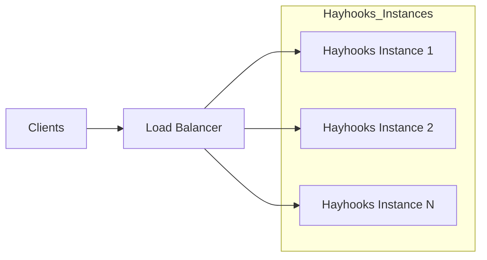

# Advanced Configuration

This section covers advanced configuration options for customizing Hayhooks behavior, performance tuning, and deployment optimization.

## Environment Configuration

### Production Settings

```ini
# .env file for production deployment
HAYHOOKS_HOST=0.0.0.0
HAYHOOKS_PORT=1416
HAYHOOKS_MCP_HOST=0.0.0.0
HAYHOOKS_MCP_PORT=1417
HAYHOOKS_PIPELINES_DIR=./pipelines
HAYHOOKS_ADDITIONAL_PYTHON_PATH=./custom_modules
HAYHOOKS_ROOT_PATH=/
HAYHOOKS_DISABLE_SSL=false
HAYHOOKS_USE_HTTPS=false
HAYHOOKS_SHOW_TRACEBACKS=false
LOG=INFO

# Security settings
HAYHOOKS_CORS_ALLOW_ORIGINS=["https://yourdomain.com"]
HAYHOOKS_CORS_ALLOW_METHODS=["*"]
HAYHOOKS_CORS_ALLOW_HEADERS=["*"]
HAYHOOKS_CORS_ALLOW_CREDENTIALS=false
HAYHOOKS_CORS_EXPOSE_HEADERS=[]
HAYHOOKS_CORS_MAX_AGE=600
# Note: to change the number of workers use the CLI flag,
# for example: `hayhooks run --workers 4`
```

### Performance Tuning

- Scale out vertically by running multiple workers (CPU or high concurrency):

```bash
hayhooks run --workers 4
```

- Prefer async pipelines and methods for I/O-bound workloads to avoid blocking the main async event loop:

```python
from haystack import AsyncPipeline

class PipelineWrapper(BasePipelineWrapper):
    def setup(self) -> None:
        self.pipeline = AsyncPipeline.loads((Path(__file__).parent / "pipeline.yml").read_text())

    async def run_api_async(self, query: str) -> str:
        result = await self.pipeline.run_async({"prompt": {"query": query}})
        return result["llm"]["replies"][0]
```

- Use streaming helpers for chat endpoints to reduce latency and improve user experience:

```python
from hayhooks import async_streaming_generator, get_last_user_message

async def run_chat_completion_async(self, model: str, messages: list[dict], body: dict):
    question = get_last_user_message(messages)
    return async_streaming_generator(
        pipeline=self.pipeline,
        pipeline_run_args={"prompt": {"query": question}},
    )
```

- Scale horizontally behind a load balancer for CPU-bound pipelines or heavy traffic



## Custom Pipeline Directory Structure

### Organized Pipeline Layout

```text
pipelines/
├── production/
│   ├── chat_pipeline/
│   │   ├── pipeline_wrapper.py
│   │   ├── requirements.txt
│   │   └── config.yaml
│   └── rag_pipeline/
│       ├── pipeline_wrapper.py
│       ├── requirements.txt
│       └── config.yaml
├── development/
│   └── experimental/
│       └── new_pipeline.py
└── shared/
    └── common_components/
        └── utils.py
```

### Custom Directory Configuration

```ini
# .env
HAYHOOKS_PIPELINES_DIR=./custom_pipelines
HAYHOOKS_ADDITIONAL_PYTHON_PATH=./shared_modules
```

## Custom Routes and Middleware

### Add custom routes or middleware (via create_app)

```python
import uvicorn
from hayhooks.settings import settings
from fastapi import Request
from hayhooks import create_app

# Create the Hayhooks app
hayhooks = create_app()

# Add a custom route
@hayhooks.get("/custom")
async def custom_route():
    return {"message": "Hi, this is a custom route!"}

# Add a custom middleware
@hayhooks.middleware("http")
async def custom_middleware(request: Request, call_next):
    response = await call_next(request)
    response.headers["X-Custom-Header"] = "custom-header-value"
    return response

if __name__ == "__main__":
    uvicorn.run("app:hayhooks", host=settings.host, port=settings.port)
```

## Logging

Hayhooks uses loguru under the hood and exposes a logger:

```python
from hayhooks import log

log.info("Server starting")
log.debug("Details", extra={"foo": "bar"})
log.error("Something went wrong")
```

Configure level via env:

```bash
LOG=DEBUG hayhooks run
```

## Best Practices

### 1. Configuration Management

- Use environment variables for all configuration
- Implement configuration validation
- Separate development and production configurations
- Use configuration management tools for large deployments

### 2. Security

- Implement proper authentication and authorization
- Use HTTPS in production
- Validate all inputs
- Implement rate limiting and request throttling

### 3. Performance

- Use appropriate worker counts for your hardware
- Implement caching for frequently accessed data
- Monitor resource usage and scale accordingly
- Use connection pooling for database connections

### 4. Monitoring

- Implement comprehensive logging
- Set up metrics collection
- Configure health checks
- Set up alerting for critical issues

## Next Steps

- [Deployment Guidelines](../deployment/deployment-guidelines.md) - Production deployment
- [Code Sharing](code-sharing.md) - Reusable components
- [Custom Routes](custom-routes.md) - Custom endpoint development
