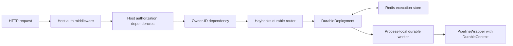

# Portable FastAPI durable integration plan

**Status:** Proposed

**Scope:** Hayhooks durable REST integration, authentication composition, and runtime ownership

**Primary objective:** Make Hayhooks use the same public durable integration that an independent FastAPI application uses

## Summary

Hayhooks already has a durable execution engine with Redis-backed recovery,
fenced leases, idempotent submission, retries, progress, cancellation, and
wait/resume. The engine is usable from a standalone `DurableRuntime`, but the
current REST integration is implemented inside the Hayhooks server and reaches
into process-global runtime and registry state.

This plan introduces one public FastAPI adapter and makes Hayhooks consume it:

1. Applications own a `DurableRuntime` and start and close it in their lifespan.
2. `create_durable_router()` returns a standard FastAPI `APIRouter` for one
   `DurableDeployment`.
3. An ordinary FastAPI dependency supplies a stable owner ID when authenticated
   ownership isolation is required.
4. Hayhooks keeps only a small internal mount/unmount shim for its dynamic
   pipeline deployment lifecycle.
5. Hayhooks REST, A2A, and MCP applications move from the process-global runtime
   to application-owned runtime instances.

The durable engine remains unaware of JWTs, cookies, sessions, middleware,
FastAPI application state, and the Hayhooks registry. Redis remains the source
of truth for execution state.

## Goals

- Provide a simple, documented public integration for an existing FastAPI
  application.
- Compose with authentication middleware and existing FastAPI dependencies.
- Preserve typed request, resume, and result schemas in OpenAPI.
- Preserve all current durable REST paths and response semantics.
- Make ownership enforcement consistent for submit, inspect, cancel, and
  resume.
- Make Hayhooks dogfood the public router rather than maintaining separate REST
  handlers.
- Make each application instance own its runtime, workers, and provider
  lifecycle.
- Preserve dynamic deploy, overwrite, rollback, and undeploy behavior in the
  Hayhooks server.
- Keep Redis keys and persisted execution records unchanged.
- Maintain the current controlled-beta multi-process execution model.

## Non-goals

- A generic non-Haystack job framework.
- Authentication or authorization implemented by the durable engine.
- Persisting access tokens, sessions, or complete principal objects.
- A custom FastAPI middleware supplied by Hayhooks.
- A mounted durable sub-application.
- A `DurableRouter` subclass or a stateful integration/service container.
- Per-operation authorization hooks in the first public API.
- Separating API-only and worker-only processes in this change.
- Changing the Redis schema, execution state machine, or delivery semantics.
- Replacing Hayhooks' dynamic pipeline deployment transaction.

## Current state

### Durable runtime

`DurableRuntime` owns deployment managers and a shared execution-store provider.
`DurableDeployment` owns the typed wrapper contract, Haystack adapter, store,
and worker manager. Redis or the in-memory reference backend owns persisted
execution data.

The current standalone embedding path is valid, but it requires applications to
write their own HTTP handlers. The public facade also omits several types that
an embedding application naturally needs.

### REST transport

The current durable REST handlers live in
`hayhooks.server.durable.routes`. That module currently combines four concerns:

- reusable durable HTTP behavior;
- Hayhooks trusted-header owner resolution;
- process-global runtime discovery;
- Hayhooks registry metadata and dynamic route mutation.

Only the first concern belongs in a portable FastAPI adapter.

### Runtime ownership

Hayhooks REST, A2A, MCP, status, and deployment code currently import the same
module-level `durable_runtime`. This makes multiple application instances in a
single process share deployments, provider ownership, and shutdown behavior.
An independent FastAPI application would instead create and own its runtime.

## Architectural decision

### Chosen design

Use a public `APIRouter` factory and a FastAPI owner-ID dependency:

```python
from collections.abc import Awaitable, Callable


def create_durable_router(
    deployment: DurableDeployment,
    *,
    owner_id_dependency: Callable[..., str | Awaitable[str]] | None,
) -> APIRouter:
    ...
```

The owner dependency is a required keyword. Passing `None` is an explicit
choice to use unscoped bearer-by-execution-ID access. Supplying a dependency
enables owner isolation.

The function returns routes only. It does not start workers, own the runtime,
mutate a registry, or alter an application. The caller uses ordinary FastAPI
composition:

```python
app.include_router(
    create_durable_router(
        deployment,
        owner_id_dependency=current_owner_id,
    ),
    prefix="/jobs",
)
```

### Why `APIRouter`

- It is FastAPI's native unit of route composition.
- Host middleware automatically wraps included routes.
- Dependencies compose with existing authentication and authorization.
- Typed request and response models remain visible in OpenAPI.
- Applications control prefixes, tags, and router-level dependencies.
- Hayhooks can include the same router dynamically and retain its existing
  route replacement logic.
- The adapter has no lifecycle or global state of its own.

### Why a dependency rather than a callback

A callback invoked manually by the route handler would need to reproduce part
of FastAPI's dependency system. A dependency already supports:

- middleware-populated `request.state`;
- nested `Depends(...)` authentication dependencies;
- OAuth/OpenAPI security dependencies;
- async and sync implementations;
- application-specific `HTTPException` responses;
- dependency overrides in tests.

The durable adapter needs only the resulting stable owner ID. It does not need
to know how authentication was performed.

### Request and execution flow



Middleware runs before FastAPI dependency resolution. The host application
therefore retains control of authentication, request context, and broad API
authorization. The owner dependency reduces that context to the stable string
needed for record isolation. The router validates and translates HTTP; the
deployment and Redis store perform durable execution and recovery; the wrapper
remains independent of HTTP.

### Rejected alternatives

| Alternative | Reason for rejection |
|---|---|
| Durable authentication middleware | Couples the engine to authentication and duplicates host middleware |
| Mounted FastAPI/Starlette sub-app | Makes OpenAPI, prefixes, host middleware, and dynamic replacement harder |
| Runtime callback hooks | Bypass FastAPI dependency injection and make error/security behavior bespoke |
| Stateful integration class | Adds lifecycle and registration state that already exists in FastAPI and `DurableRuntime` |
| Manually documented endpoint examples only | Leaves each application to duplicate validation, errors, ownership, and links |
| `DurableRuntime.create_router()` | Couples the runtime layer directly to FastAPI |

## State ownership

Storing the runtime on `app.state` is intentional. It stores a process-local
service handle, not durable execution data.

| Location | Owned data |
|---|---|
| `app.state` | Runtime object, deployment definitions, worker tasks, provider/client handles |
| Python process | Wrapper instances, active call stacks, event-loop tasks |
| Redis | Controls, inputs, checkpoints, progress, waits, results, errors, leases, indexes, idempotency bindings |

After a process restart, the application reconstructs the runtime and wrapper
definitions. Redis retains nonterminal work. An expired running lease is
recovered and made claimable according to the existing state machine.

No execution record, checkpoint, or result should be copied into `app.state`.
This centralized-state guarantee applies when using the Redis provider. The
in-memory provider is deliberately volatile, process-local, and suitable only
for development and tests.

The public router does not need to read `app.state`; it closes over one
`DurableDeployment`. Keeping the runtime on `app.state` is recommended when
status routes, deployment utilities, or other application components need the
same process-local handle. Hayhooks itself needs that access. A small external
application may instead keep the runtime only in its application-factory
lifespan closure.

## Target external-application experience

### Wrapper authoring

Pipeline wrappers remain independent of HTTP and authentication:

```python
from pydantic import BaseModel

from hayhooks import BasePipelineWrapper
from hayhooks.durable import DurableContext


class JobRequest(BaseModel):
    document_id: str


class JobResult(BaseModel):
    indexed: bool


class JobWrapper(BasePipelineWrapper):
    durable_revision = "job-v1"

    def setup(self) -> None:
        self.pipeline = build_pipeline()

    async def run_durable_async(
        self,
        context: DurableContext,
        request: JobRequest,
    ) -> JobResult:
        result = await context.run_pipeline_async(
            {"loader": {"document_id": request.document_id}},
            checkpoint_at=["loader"],
        )
        return JobResult(indexed=bool(result["loader"]["indexed"]))
```

The deployment continues to derive its Pydantic request and result contracts
from the wrapper method annotations.

### Authentication middleware

When middleware has already authenticated the request and populated
`request.state`:

```python
from fastapi import Request


def current_owner_id(request: Request) -> str:
    principal = request.state.principal
    return f"{principal.tenant_id}:{principal.subject_id}"
```

When the application already uses dependencies:

```python
from typing import Annotated

from fastapi import Depends


async def current_owner_id(
    principal: Annotated[Principal, Depends(require_principal)],
) -> str:
    return f"{principal.tenant_id}:{principal.subject_id}"
```

Both forms have the same durable behavior.

### Runtime and router

```python
from contextlib import asynccontextmanager

from fastapi import Depends, FastAPI

from hayhooks.durable import (
    DurableRuntime,
    RedisExecutionStoreProvider,
    create_durable_router,
)


@asynccontextmanager
async def lifespan(app: FastAPI):
    runtime = app.state.durable_runtime
    try:
        await runtime.start()
        yield
    finally:
        await runtime.close()


def create_app() -> FastAPI:
    provider = RedisExecutionStoreProvider(
        redis_url="redis://localhost:6379/0",
        key_prefix="myapp:durable",
    )
    runtime = DurableRuntime(provider)

    wrapper = JobWrapper()
    wrapper.setup()
    deployment = runtime.deployment("jobs", wrapper)

    app = FastAPI(lifespan=lifespan)
    app.state.durable_runtime = runtime
    app.include_router(
        create_durable_router(
            deployment,
            owner_id_dependency=current_owner_id,
        ),
        prefix="/jobs",
        dependencies=[Depends(require_jobs_permission)],
    )
    return app


app = create_app()
```

The router-level authorization dependency is optional. Ownership and general
authorization remain distinct:

- `require_jobs_permission` decides whether the caller may use the job API.
- `current_owner_id` provides the stable identity used to isolate records.

## Public router behavior

### Routes

The returned router contains relative paths so the host application controls
the prefix:

| Method | Relative path | Behavior |
|---|---|---|
| `POST` | `/run-durable` | Validate and submit detached work |
| `GET` | `/executions/{execution_id}` | Inspect safe execution state |
| `POST` | `/executions/{execution_id}/cancel` | Request cooperative cancellation |
| `POST` | `/executions/{execution_id}/resume` | Resume waiting work with optional typed input |

Hayhooks includes the router at `/{pipeline_name}`, preserving all existing
paths.

### Dependency binding inside the factory

The factory fixes scoped versus unscoped behavior once, when the router is
created. When an owner dependency is supplied, each route binds it with
`Depends(...)`, validates its resolved return value, and sets
`enforce_owner=True`. When `None` is supplied, each route binds a private
constant dependency that returns `None`, and sets `enforce_owner=False`.

Do not let a configured dependency return `None` to select unscoped behavior
at request time. That would turn an authentication bug into an authorization
bypass. The dependency's sync or async execution remains FastAPI's
responsibility.

### Response behavior

The extraction must preserve:

| Situation | Response |
|---|---|
| New submission | `202 Accepted` |
| Nonterminal idempotent replay | `202 Accepted` plus `Idempotent-Replay: true` |
| Retained terminal replay | `200 OK` plus `Idempotent-Replay: true` |
| Accepted cancellation | `202 Accepted` |
| Already terminal cancellation | `200 OK` |
| Successful resume | `202 Accepted` |
| Missing or foreign-owned execution | `404 Not Found` |
| Idempotency or revision conflict | `409 Conflict` |
| Execution is not waiting | `409 Conflict` |
| Invalid ID, request, or resume body | `422 Unprocessable Entity` |
| Admission limit | `503 Service Unavailable` plus `Retry-After` |
| Execution-store outage | `503 Service Unavailable` |

The `Location` and result links must be generated with named-route resolution
through `request.url_for(...)`, rather than by concatenating the deployment
name. Each factory result must give its routes deployment-unique names, such as
`hayhooks.durable.{deployment_name}.inspect`, so multiple durable deployments
cannot resolve one another's links. Hayhooks deployment names are unique within
an application; including the same deployment router more than once is outside
the initial contract.

Named resolution keeps links correct when the router is included below
additional application prefixes or root paths. Preserve the current relative
link contract by using the resolved URL's path component for response links and
the `Location` header.

### Typed OpenAPI models

The adapter keeps the current dynamic request and result model behavior:

- submission uses `deployment.request_type`;
- result fields use `deployment.result_type` when declared;
- resume uses `deployment.resume_type` when declared;
- inspect, cancel, and resume return the safe execution projection;
- private input, state, checkpoints, owner, and fencing details remain absent.

The implementation may continue setting endpoint annotations/signatures after
handler construction because FastAPI consumes those annotations during route
registration.

## Ownership and authentication contract

### Owner ID rules

When `owner_id_dependency` is supplied, the adapter must require:

- a string;
- at least one character;
- no more than 512 characters;
- a stable value across token refreshes and process restarts.

Recommended values are immutable application IDs, for example
`tenant_uuid:user_uuid`. Do not use access tokens, session IDs, emails, or
display names.

The host application chooses the ownership granularity. Use a tenant ID for
tenant-owned jobs, a user ID for user-owned jobs, or a stable compound ID when
both boundaries matter.

The dependency should perform authentication and may raise the host
application's normal `401` or `403`. The durable adapter must not replace those
responses.

When the dependency is configured, a missing or invalid owner must fail closed.
It must never switch the request to unscoped access.

### Enforcement

The adapter passes the owner to every deployment operation:

```python
await deployment.submit(..., owner_id=owner_id)
await deployment.get(..., owner_id=owner_id, enforce_owner=True)
await deployment.request_cancel(..., owner_id=owner_id, enforce_owner=True)
await deployment.resume(..., owner_id=owner_id, enforce_owner=True)
```

The existing deployment behavior returns `KeyError` for both missing records
and owner mismatches. The router maps both to `404`, avoiding an execution-ID
existence oracle.

Owner-scoped submission continues deriving the internal execution ID from the
owner and caller-provided idempotency key. The same external key can therefore
be used independently by different owners.

### Unscoped mode

Passing `owner_id_dependency=None` explicitly retains the current behavior:

- records have no owner;
- possession of a sufficiently unguessable execution ID grants access;
- the router does not enforce owner matching.

This is useful for local development and services protected by a single
application-wide authorization boundary. Documentation must label it as an
explicit security choice, not an authentication default.

### Wrapper access to identity

Background work cannot depend on an HTTP request, middleware state, cookies,
or a current token. Those values do not exist after process recovery.

Add a minimal public property to `DurableContext`:

```python
@property
def owner_id(self) -> str | None:
    return self.record.owner_id
```

This lets durable application code use the persisted stable identity without
exposing the full private execution record as its normal API.

Roles and permissions should be checked before submission. Full principal
objects and tokens must not be persisted automatically. If a job needs
additional trusted identifiers, they must be deliberately represented as
non-secret validated input or durable application state.

## Hayhooks dogfooding design

### Public adapter boundary

Create `src/hayhooks/durable/fastapi.py`. It owns all reusable HTTP behavior and
imports only durable public/infrastructure types plus FastAPI/Pydantic.

It must not import:

- `hayhooks.server.pipelines.registry`;
- the module-level `durable_runtime`;
- `hayhooks.settings`;
- `BasePipelineWrapper`;
- deployment or route mutation utilities from `hayhooks.server`.

### Hayhooks server shim

Reduce `hayhooks.server.durable.routes` to Hayhooks-specific composition:

1. Determine whether the deployment has durable capability.
2. Build the trusted-header owner dependency from that deployment's settings.
3. Remove the previous durable route family for the pipeline.
4. Include `create_durable_router(deployment, ...)` at
   `/{pipeline_name}`.
5. Invalidate/rebuild OpenAPI according to the existing deferred-rebuild flag.

The trusted-header dependency remains a Hayhooks server concern because a
third-party application should normally use its authenticated principal rather
than trust a configurable raw header.

The current `durable_request_model` and `durable_response_model` registry
metadata is not read elsewhere in the codebase. Remove those writes rather than
adding a public result object solely to preserve unused internal metadata.

### Dynamic deployment lifecycle

Hayhooks must preserve the existing publication transaction:

1. Capture the current wrapper, routes, OpenAPI schema, modules, files, and
   durable deployment.
2. Quiesce and close the previous deployment when replacing it.
3. Reject replacement while nonterminal durable work would be stranded.
4. Prepare the new wrapper and durable deployment before publication.
5. Build/include routes whose closures reference the new deployment.
6. Publish registry and runtime state and activate the candidate without an
   intervening await point.
7. Restore the previous routes, runtime deployment, modules, files, and worker
   state if publication fails.

`APIRouter` inclusion produces ordinary `APIRoute` instances on the application,
so the current path-based removal and route-list snapshot rollback remain
usable. Do not introduce a route-mount handle or registration class unless the
existing mechanism proves insufficient in tests.

## Application-owned runtime design

### REST factory

Update the application factory without breaking existing callers:

```python
def create_app(*, durable_runtime: DurableRuntime | None = None) -> FastAPI:
    runtime = durable_runtime or DurableRuntime()
    app = FastAPI(...)
    app.state.durable_runtime = runtime
    ...
```

The lifespan reads the runtime from the application instance, starts it after
startup pipeline preparation, and closes it before application-owned dependent
resources are closed.

Status endpoints should read the runtime from `request.app.state`, not import a
singleton.

Deployment helpers should receive the runtime explicitly when no application is
available, or use the runtime attached to the supplied application. Avoid a
fallback that silently selects the process-global runtime.

### A2A and MCP factories

Apply the same ownership rule to other server factories:

- `create_a2a_app(..., durable_runtime=runtime)`;
- `create_agent_executor(..., durable_runtime=runtime)`;
- A2A health reads its supplied runtime;
- MCP server/application factories retain and close their supplied runtime.

CLI commands construct one runtime for the server they launch and pass that
same instance through construction and lifespan.

### Compatibility singleton

Keep `hayhooks.durable.durable_runtime` temporarily as a compatibility export,
but stop using it inside Hayhooks. Document application-owned `DurableRuntime`
as the supported integration. Removal of the singleton, if desired, should be a
separate deprecation decision.

Removing internal use of the singleton also removes the need for the private
runtime-to-registry attachment. Registry discovery remains a Hayhooks server
responsibility; standalone runtimes continue to know only deployments that the
application explicitly attaches.

## Multi-process behavior

Every Uvicorn worker process creates its own application state, runtime, worker
tasks, and Redis client/pool. All processes use the same Redis namespace and
definition revision for a logical deployment.

The existing Redis fences and leases coordinate claims across processes. The
effective execution concurrency is:

```text
application processes × durable_execution_concurrency per deployment
```

The first rollout should remain within the controlled-beta profile of one to
three replicas with conservative per-process concurrency. Application state is
not shared and must never be treated as a cross-process coordination mechanism.

## Implementation phases

### Phase 0: Lock the existing HTTP contract

Before moving handlers, add or identify focused tests for every existing route,
status code, response header, owner behavior, typed model, and error mapping.
These tests define extraction compatibility.

No implementation behavior changes in this phase.

### Phase 1: Add the public FastAPI adapter

Add:

- `src/hayhooks/durable/fastapi.py`;
- `tests/test_durable_fastapi.py` containing a standalone FastAPI app.

Update:

- `src/hayhooks/durable/__init__.py` to lazily export
  `create_durable_router`, `DurableContext`, `DurableDeployment`, and the public
  durable exceptions;
- `src/hayhooks/durable/context.py` with `owner_id`;
- durable embedding documentation with authenticated and unscoped examples.

Move, rather than rewrite, the existing validation, response projection, and
error mapping. Keep the diff behavior-preserving.

### Phase 2: Make Hayhooks REST consume the adapter

Update:

- `src/hayhooks/server/durable/routes.py` to contain only trusted-header
  dependency construction and dynamic route composition;
- `src/hayhooks/server/utils/deploy_utils.py` to pass the prepared
  `DurableDeployment` into the composition shim;
- durable REST and deployment lifecycle tests.

Delete the duplicated endpoint handlers from the server module. Preserve route
paths and operation behavior.

### Phase 3: Replace internal global-runtime use

Update REST, status, deploy/undeploy, A2A, MCP, and their app factories to pass
an application-owned runtime explicitly. Store the REST runtime on `app.state`.

Keep each protocol migration reviewable. A safe order is:

1. REST app and status endpoints;
2. REST dynamic deployment transaction;
3. A2A app, executors, and health;
4. MCP server and lifespan;
5. remove all internal imports of the singleton;
6. remove the private registry attachment from `runtime.py`.

The phase is complete when searching `src/hayhooks/server` finds no import of
the module-level `durable_runtime`.

### Phase 4: Focus durable configuration

Introduce a durable-only configuration model containing Redis connection,
retention, record limits, lease, retry, polling, shutdown, admission, and
concurrency settings.

Allow built-in providers and `DurableRuntime` to consume it without requiring
the full Hayhooks `AppSettings`. Retain an internal conversion from Hayhooks
settings for server compatibility.

Keep this separate from route extraction so configuration changes cannot hide
HTTP regressions.

### Phase 5: Release and adoption

- Run the external FastAPI example against a built wheel rather than the source
  checkout.
- Update API and durable-engine documentation.
- Note application-owned runtime and router integration in release notes.
- Pin the target application's trial to the released version.
- Start with one authenticated deployment and a dedicated Redis namespace.

## Test plan

### Public adapter tests

The standalone test application must not import `hayhooks.server.app`, the
Hayhooks registry, or the global runtime.

Cover:

- typed submission and result validation;
- typed resume input;
- all four routes;
- generated OpenAPI schemas;
- new submission and idempotent replay headers/statuses;
- cancellation before and after terminal state;
- wait/resume and revision conflict;
- invalid execution IDs and idempotency keys;
- record-size and admission failures;
- normalized execution-store failures;
- safe views excluding private fields;
- link resolution beneath an additional `include_router(prefix=...)` prefix.

### Authentication and ownership matrix

| Scenario | Expected result |
|---|---|
| Middleware rejects unauthenticated caller | Host application's `401` |
| Owner dependency raises `403` | Host application's `403` |
| Configured dependency returns empty/invalid owner | Fail closed; never unscoped |
| Alice submits and inspects | Success |
| Bob inspects Alice's execution | `404` |
| Bob cancels Alice's execution | `404` |
| Bob resumes Alice's execution | `404` |
| Alice reuses same key and input | Idempotent replay |
| Alice reuses same key with different input | `409` |
| Bob uses Alice's external key | Independent execution |
| Explicit unscoped router | Existing bearer-ID behavior |

Provide one test where middleware writes `request.state.principal`, and another
where the owner dependency depends on an existing FastAPI authentication
dependency.

### Hayhooks dogfooding regression tests

Preserve and extend tests for:

- startup deployment route creation;
- dynamic deployment after runtime start;
- durable-to-durable overwrite;
- durable-to-nondurable overwrite;
- undeploy route removal;
- refusal to strand queued, running, or waiting work;
- candidate preparation failure;
- publication failure and route rollback;
- OpenAPI replacement with new request/result/resume types;
- trusted owner header compatibility;
- deferred OpenAPI rebuild during batch startup.

### Runtime ownership tests

- Two FastAPI applications in one process receive distinct runtimes.
- A deployment installed in app A is absent from app B.
- Closing app A does not close app B's provider or workers.
- A supplied runtime is the one used by routes, status, and deployment helpers.
- REST, A2A, and MCP lifespans close only the runtime they own.
- Startup failure still closes the corresponding runtime exactly once.

### Existing engine tests

The following remain mandatory:

- reducer and reference-store contract tests;
- Redis transaction and concurrent-claim tests;
- manager retry, cancellation, and lease tests;
- process-kill/restart recovery;
- A2A recovery tests;
- type checking and linting.

## Compatibility requirements

### HTTP compatibility

- Existing Hayhooks durable paths remain unchanged.
- Existing request and response payloads remain unchanged.
- Status codes and headers remain unchanged.
- Owner mismatch remains indistinguishable from a missing execution.
- Current trusted owner header behavior remains available in the Hayhooks
  server shim.

### Python compatibility

- Existing direct imports continue to work.
- New public imports are additive.
- The global `durable_runtime` remains importable during the compatibility
  period.
- `create_app()` with no arguments continues to work, but owns a new runtime.
- Supplying a runtime is keyword-only.

### Persistence compatibility

This work must not modify:

- Redis key construction;
- control serialization;
- payload formats;
- idempotency digests;
- execution state transitions;
- lease or fence semantics.

No namespace migration is required for this integration refactor.

## Operational guidance

- Use an isolated Redis key prefix per application/environment.
- Use Redis 6.2 or later with persistence, backups, TLS/authentication as
  appropriate, and `maxmemory-policy noeviction`.
- If the host application supplies a Redis client, durable storage requires
  binary responses (`decode_responses=False`).
- Set `close_redis=False` when the host owns the client lifecycle.
- Close the durable runtime before closing a shared Redis client.
- Keep wrapper definition revisions identical across replicas.
- Account for Uvicorn workers when setting durable concurrency.
- Continue making every external side effect idempotent because execution is
  at least once.

## Risks and mitigations

| Risk | Mitigation |
|---|---|
| Router extraction changes an HTTP edge case | Lock the current contract before moving handlers |
| Included router links ignore a host prefix | Generate links from named routes and the current request |
| Owner dependency accidentally returns `None` | Fail closed whenever a dependency is configured |
| Authentication data is expected during background recovery | Persist only owner ID and deliberate validated identifiers |
| Dynamic overwrite leaves old handlers active | Remove the known route family before including the candidate router |
| Publication failure loses previous routes | Retain the existing route-list snapshot rollback |
| Multiple app instances share shutdown state | Construct and attach one runtime per app |
| Multi-worker deployments create unexpected concurrency | Document and test the process × slot calculation |
| Scope expands into a workflow framework | Keep generic runners, schedules, and transport-independent auth out of this work |

## Acceptance criteria

The work is complete when all of the following are true:

1. An independent FastAPI application can integrate durable execution using
   only public Hayhooks imports.
2. That application can supply identity from middleware or an existing FastAPI
   authentication dependency.
3. Hayhooks' own durable REST endpoints are created by the same public router
   factory.
4. The public router has no dependency on the Hayhooks registry, global runtime,
   or server settings.
5. Hayhooks server modules no longer import the global durable runtime.
6. Every app/server factory owns and closes its runtime.
7. Durable wrappers remain HTTP-independent and can read their stable owner via
   `DurableContext.owner_id`.
8. Existing REST paths, schemas, status codes, headers, and owner behavior are
   preserved.
9. Dynamic deployment, rollback, and undeploy tests remain green.
10. Live Redis and process-recovery tests remain green.
11. Redis data written before this refactor remains readable without migration.
12. Documentation includes authenticated, unscoped, shared-Redis, and
    multi-worker examples.

## Deliberately deferred extensions

Add these only when a real integration requires them:

- per-operation authorization dependencies;
- API-only versus worker-only runtime modes;
- generic non-Haystack runners;
- richer persisted principal metadata;
- customizable durable route shapes;
- a stable Redis schema migration framework.

The first portable release should contain the smallest complete boundary:
application-owned runtime, one public router factory, and one owner-ID
dependency.
