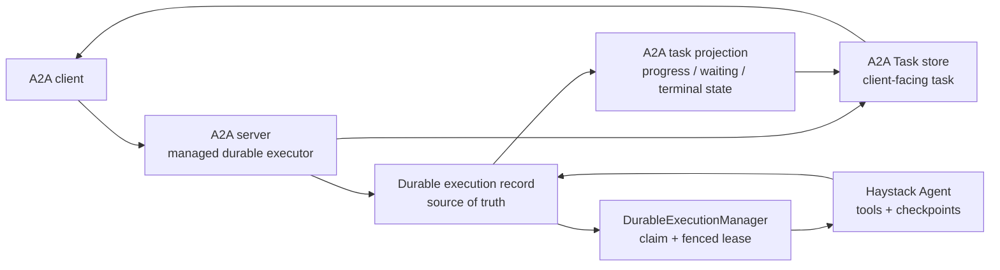

# A2A Support

Hayhooks supports the [A2A protocol](https://a2a-protocol.org) (Agent2Agent) and can act as an A2A server, exposing deployed pipelines and agents as A2A agents that other agents can discover and delegate tasks to.

A2A complements [MCP support](mcp-support.md): MCP exposes pipelines as **tools** for an agent to call (agent→tool), while A2A exposes them as **agents** that other agents talk to (agent→agent).

## Overview

The Hayhooks A2A Server:

- Exposes deployed chat and durable Agent wrappers as A2A agents
- Serves a per-agent [Agent Card](#agent-cards) for discovery, auto-generated from the pipeline and customizable from the wrapper
- Implements the JSON-RPC protocol binding of the [A2A specification](https://a2a-protocol.org/latest/specification/) (v1.0), including SSE streaming
- Streams pipeline output incrementally as task artifact updates
- Supports detached long-running task execution with polling, subscription, and cooperative async cancellation

## Requirements

- Install with `pip install hayhooks[a2a]` (uses the official [a2a-sdk](https://github.com/a2aproject/a2a-python)
  and [redis-py](https://redis.io/docs/latest/develop/clients/redis-py/) clients)

## Getting Started

### Install with A2A Support

```bash
pip install hayhooks[a2a]
```

### Start the A2A Server

```bash
hayhooks a2a run
```

This starts the A2A server on `HAYHOOKS_A2A_HOST:HAYHOOKS_A2A_PORT` (default: `localhost:1418`), deploying pipelines from `HAYHOOKS_PIPELINES_DIR` (or `--pipelines-dir`).

### Configuration

Environment variables for the A2A server:

```bash
HAYHOOKS_A2A_HOST=localhost         # A2A server host
HAYHOOKS_A2A_PORT=1418              # A2A server port
HAYHOOKS_A2A_EXTERNAL_URL=          # Base URL advertised in agent cards
                                    # (set when behind a reverse proxy)
HAYHOOKS_A2A_V0_3_COMPAT=true       # Also accept A2A spec 0.3 requests
                                    # (used by older clients and tools)
HAYHOOKS_A2A_TASK_STORE=auto        # auto, memory, or redis
HAYHOOKS_A2A_REDIS_URL=redis://localhost:6379/0
HAYHOOKS_A2A_REDIS_KEY_PREFIX=hayhooks:a2a
HAYHOOKS_DURABLE_STORE=redis        # Redis by default; memory is volatile
HAYHOOKS_DURABLE_REDIS_URL=redis://localhost:6379/0
HAYHOOKS_DURABLE_REDIS_KEY_PREFIX=hayhooks:durable
HAYHOOKS_DURABLE_EXECUTION_CONCURRENCY=1
                                    # Operator ceiling per durable Agent
```

## Which pipelines are exposed

A deployed pipeline is exposed as an A2A agent when it uses either authoring mode:

- **Chat compatibility**: implement `run_chat_completion` or `run_chat_completion_async`, the same methods used by the [OpenAI-compatible chat endpoints](openai-compatibility.md).
- **Durable Agent**: inherit from `hayhooks.a2a.A2APipelineWrapper` and assign a Haystack 3 `Agent` to `self.pipeline`. Hayhooks supplies the detached executor, checkpoints, progress projection, and durable store.

To exclude a chat-capable pipeline from A2A, set `skip_a2a` on the wrapper:

```python
class PipelineWrapper(BasePipelineWrapper):
    skip_a2a = True
```

## Endpoints

Each exposed pipeline is mounted under its own path prefix:

| Endpoint | Description |
|----------|-------------|
| `GET /{pipeline_name}/.well-known/agent-card.json` | The pipeline's agent card |
| `POST /{pipeline_name}/` | JSON-RPC binding (`SendMessage`, `SendStreamingMessage`, `GetTask`, ...) |
| `GET /status` | Operational readiness and the list of exposed agents; not an A2A protocol method |

For example, with a deployed `weather_agent` pipeline:

```bash
curl http://localhost:1418/weather_agent/.well-known/agent-card.json
```

The operational status endpoint returns `200` only when the configured task
store, executor lifecycle, maintenance loop, and (for managed
durable Agents) durable execution runtime are healthy. It returns `503` with
`status: unavailable` otherwise. The A2A specification does not define a
health method; Agent Cards and their advertised interfaces remain the
standards-compliant discovery and protocol surface.

## Agent Cards

Agent cards are generated automatically: the card name is the pipeline name, the description comes from the pipeline's registry metadata, and a single default skill is created. Override any of it with the `a2a_card` class attribute:

```python
class PipelineWrapper(BasePipelineWrapper):
    a2a_card = {
        "name": "weather_agent",
        "description": "Answers questions about the current weather in any city.",
        "version": "2.0.0",
        "skills": [
            {
                "id": "get_current_weather",
                "name": "Get current weather",
                "description": "Report current conditions for a city.",
                "tags": ["weather"],
                "examples": ["What's the weather in Berlin right now?"],
            }
        ],
    }
```

## Calling an agent

With the [a2a-sdk](https://github.com/a2aproject/a2a-python) client:

```python
import asyncio

import httpx
from a2a.client import A2ACardResolver, ClientConfig, create_client
from a2a.helpers import get_stream_response_text, new_text_message
from a2a.types import Role, SendMessageRequest


async def main():
    async with httpx.AsyncClient() as httpx_client:
        resolver = A2ACardResolver(httpx_client=httpx_client, base_url="http://localhost:1418/weather_agent")
        card = await resolver.get_agent_card()

        client = await create_client(agent=card, client_config=ClientConfig(streaming=True, httpx_client=httpx_client))
        try:
            request = SendMessageRequest(message=new_text_message("Weather in Berlin?", role=Role.ROLE_USER))
            async for response in client.send_message(request):
                if response.HasField("artifact_update"):
                    print(get_stream_response_text(response), end="", flush=True)
        finally:
            await client.close()


asyncio.run(main())
```

Or with plain JSON-RPC over HTTP:

```bash
curl -s http://localhost:1418/weather_agent/ \
  -H "Content-Type: application/json" -H "A2A-Version: 1.0" \
  -d '{"jsonrpc": "2.0", "id": "1", "method": "SendMessage",
       "params": {"message": {"messageId": "m1", "role": "ROLE_USER",
                              "parts": [{"text": "Weather in Berlin?"}]}}}'
```

## Chat-compatibility task lifecycle and streaming

In chat-compatibility mode, each request is handled as an A2A task:

1. A `Task` is created from the incoming message.
2. The task transitions to `working` and the pipeline's chat completion method runs.
3. Pipeline output is emitted as a single `response` artifact. Streaming results (generators returned by `streaming_generator` / `async_streaming_generator`) are emitted incrementally as artifact chunk updates, so `SendStreamingMessage` clients receive text as it is produced.
4. The task ends in `completed`, `failed`, or `canceled`. Enable `HAYHOOKS_SHOW_TRACEBACKS` to include tracebacks in failure messages.

Native executors own their protocol lifecycle. Durable Agents instead project
their authoritative durable execution into an A2A task as described under
[Durable Haystack Agents](#durable-haystack-agents).

By default, non-streaming `SendMessage` remains blocking for backward compatibility: the response is returned after the task reaches a terminal or interrupted state.

For detached execution, set `configuration.returnImmediately`:

```bash
curl -s http://localhost:1418/weather_agent/ \
  -H "Content-Type: application/json" -H "A2A-Version: 1.0" \
  -d '{"jsonrpc": "2.0", "id": "1", "method": "SendMessage",
       "params": {"configuration": {"returnImmediately": true},
                  "message": {"messageId": "m1", "role": "ROLE_USER",
                              "parts": [{"text": "Start the long task"}]}}}'
```

The response contains a non-terminal task. Poll it with `GetTask`:

```bash
curl -s http://localhost:1418/weather_agent/ \
  -H "Content-Type: application/json" -H "A2A-Version: 1.0" \
  -d '{"jsonrpc": "2.0", "id": "2", "method": "GetTask",
       "params": {"id": "<task-id>"}}'
```

Or subscribe to an active task with `SubscribeToTask` to receive the latest task snapshot followed by task updates over SSE:

```bash
curl -N http://localhost:1418/weather_agent/ \
  -H "Content-Type: application/json" -H "A2A-Version: 1.0" \
  -d '{"jsonrpc": "2.0", "id": "3", "method": "SubscribeToTask",
       "params": {"id": "<task-id>"}}'
```

When `HAYHOOKS_A2A_V0_3_COMPAT=true`, A2A 0.3 clients can request the same detached behavior with `configuration.blocking=false`.

## Task storage

With `HAYHOOKS_A2A_TASK_STORE=auto`, Hayhooks uses Redis for Redis-backed durable Agents and otherwise gives each exposed agent its own A2A SDK `InMemoryTaskStore`. An explicit `memory` choice is never overridden.

Task storage is server infrastructure rather than pipeline configuration. Hayhooks includes independent in-memory and Redis-backed providers. Select the built-in Redis provider with `HAYHOOKS_A2A_TASK_STORE=redis` or `hayhooks a2a run --task-store redis`; configure its URL and key prefix with `HAYHOOKS_A2A_REDIS_URL` and `HAYHOOKS_A2A_REDIS_KEY_PREFIX`.

The SDK in-memory store is for one Hayhooks process only. It loses tasks on
restart, and a request routed to another replica cannot see tasks created by
the first. Multi-replica deployments must set the task store to `redis` and
give every replica the same Redis URL and key prefix. `auto` does this only for
Redis-backed durable Agents, so scaled chat-compatible wrappers must select `redis` explicitly.

The A2A extra includes the official Redis client. Redis task records are protobuf payloads scoped by agent and resolved owner. The configured owner resolver is the sole owner decision point; the default distinguishes unauthenticated requests from an authenticated user named `anonymous`. Durable execution IDs are internal fixed-size hashes of that owner and the opaque A2A task ID, so clients must keep using the original A2A task ID.

Redis stores each task and its version in one hash, with derived owner, active, and expiry indexes. Writes use bounded `WATCH`/`MULTI` transactions and Redis server time; they do not require Lua or `EVAL`. All keys for one agent share a Redis Cluster hash slot. Restart recovery relies on the durable engine's idempotent submission and persists each complete task projection with one compare-and-set write, so a stale replica cannot overwrite a newer task state. Persistent task records do not replay historical live event queues.

A durable Agent accepts another user message only while its execution is
waiting for input. A follow-up sent while it is running is rejected rather than
being treated as an idempotent redelivery; clients should wait for
`INPUT_REQUIRED` before continuing a task.

Terminal tasks use `HAYHOOKS_A2A_TERMINAL_TASK_TTL_SECONDS`. Runtime maintenance performs cleanup even when no later A2A request arrives and removes the protobuf payload and task indexes. Execution-record retention remains independent. If a task projection expires first, `GetTask` with the original task ID reconstructs its current state from the retained execution; the expired history and list entry remain gone.

Applications constructing the server directly can use a configured provider:

```python
from hayhooks.a2a import RedisTaskStoreProvider
from hayhooks.server.a2a.app import create_a2a_app
from hayhooks.server.a2a.runtime import A2ARuntime

runtime = A2ARuntime(
    task_store_provider=RedisTaskStoreProvider(
        redis_url="redis://localhost:6379/0",
        key_prefix="my-app:a2a",
    )
)
app = create_a2a_app(runtime=runtime)
```

Persisting task records alone does not make execution recoverable. For durable Agents, use Redis durable execution
(the default) and configure the A2A task store for the task history retention your clients need. Chat-compatible
execution remains process-local.

### Durable Haystack Agents

For the managed mode, use an `A2APipelineWrapper` with a Haystack 3 `Agent`. Hayhooks creates the
execution record using the A2A task ID, captures public Agent state at model/tool boundaries, and projects safe
progress, waiting, completion, failure, and cancellation states back to the A2A task.

The execution record is authoritative; the A2A Task is its persisted client-facing projection. This is why the two
records have separate retention settings, and why a persistent A2A task store alone cannot recover interrupted work.



The projection updates the task; it does not run the Agent. After a restart,
the durable worker recovers execution. Startup then refreshes any persisted
active task snapshot once; later `GetTask` and list requests project the latest
durable state directly.

```python
from haystack.components.agents import Agent
from haystack.components.generators.chat import OpenAIChatGenerator

from hayhooks import A2APipelineWrapper


class PipelineWrapper(A2APipelineWrapper):
    def setup(self) -> None:
        self.pipeline = Agent(chat_generator=OpenAIChatGenerator(), tools=[])
```

The wrapper does not create an executor, worker, record, queue, or Redis client. Durable execution uses Redis by
default; set `HAYHOOKS_DURABLE_STORE=memory` only for non-recoverable local development.
`HAYHOOKS_DURABLE_EXECUTION_CONCURRENCY` is the per-process ceiling. Increasing it requires the Agent, tools, and
their shared dependencies to be concurrency-safe.

Snapshots, validated messages, and internal tool state remain server-side. A restarted Hayhooks process reclaims
incomplete Redis work from its last safe checkpoint. Tool effects before a checkpoint may be replayed, so tools should
be idempotent. Before exposing a durable Agent, apply the
[controlled beta deployment profile](../advanced/durable-execution-operations.md#controlled-beta-deployment-profile);
in particular, authenticate the A2A endpoint and enforce request and admission
limits at the gateway. See the
[durable A2A example](https://github.com/deepset-ai/hayhooks/tree/main/examples/a2a_long_running).

## Inspecting agents with a2a-inspector

The official [a2a-inspector](https://github.com/a2aproject/a2a-inspector) is a web UI to connect to, inspect, and validate A2A agents — fetch the agent card, chat with the agent, and watch the raw protocol events. Point it at an agent's base URL, e.g. `http://localhost:1418/weather_agent`.

## Multi-agent example

See [examples/a2a_multi_agent](https://github.com/deepset-ai/hayhooks/tree/main/examples/a2a_multi_agent) for a complete demo with two agents — each with its own MCP tools — where one agent delegates to the other over A2A.

## Current limitations

- **Process-owned execution**: chat-compatible execution pauses while the A2A server is offline; durable Agents persist checkpoints and reclaim incomplete work after Hayhooks starts again.
- **Automatic task-store selection**: `auto` selects Redis only for Redis-backed durable Agents. Explicit `memory` stays process-local. A persistent task store preserves the protocol projection, but does not recover interrupted execution by itself.
- **Push notifications**: push notification delivery is not enabled yet, and agent cards do not advertise it.
- **Static agents list**: A2A routes are built from the registry at startup. Pipelines deployed or undeployed at runtime require restarting `hayhooks a2a run`.
- **Path-prefixed agent cards**: one server hosts many agents, so cards live under `/{pipeline_name}/.well-known/agent-card.json` instead of the domain root. If a consumer requires strict root-level discovery, run one A2A server instance per agent (separate `--pipelines-dir` and `--port`).
- **Cancellation is cooperative**: async chat wrappers and durable Agents can observe cancellation. A durable A2A task reports cancellation requested first and becomes A2A canceled only after the execution record is terminal canceled. Synchronous work cannot be forcibly interrupted and retains its fenced claim until it returns.
