# Chainlit Integration

Hayhooks provides optional integration with [Chainlit](https://chainlit.io/), allowing you to embed a chat UI directly within your Hayhooks server. This provides a zero-configuration frontend for interacting with your deployed Haystack pipelines.

## Overview

The Chainlit integration offers:

- **Single Deployment**: Run both backend and frontend in one process/container
- **Zero Configuration**: Works out-of-the-box with Hayhooks' OpenAI-compatible endpoints
- **Streaming Support**: Real-time streaming responses in the chat interface
- **Pipeline Selection**: Automatically discovers and lists deployed pipelines

## Installation

Install Hayhooks with the `ui` extra:

```bash
pip install "hayhooks[ui]"
```

## Quick Start

### Using CLI

The simplest way to enable the Chainlit UI is via the `--with-ui` flag:

```bash
hayhooks run --with-ui
```

This starts Hayhooks with the embedded Chainlit UI available at `http://localhost:1416/chat`.

### Custom UI Path

You can customize the URL path where the UI is mounted:

```bash
hayhooks run --with-ui --ui-path /my-chat
```

Now the UI will be available at `http://localhost:1416/my-chat`.

### Using Environment Variables

You can also configure the UI via environment variables:

```bash
export HAYHOOKS_UI_ENABLED=true
export HAYHOOKS_UI_PATH=/chat

hayhooks run
```

## Configuration

### Environment Variables

| Variable | Description | Default |
|----------|-------------|---------|
| `HAYHOOKS_UI_ENABLED` | Enable/disable the Chainlit UI | `false` |
| `HAYHOOKS_UI_PATH` | URL path where UI is mounted | `/chat` |
| `HAYHOOKS_UI_APP` | Custom Chainlit app file path | (uses default) |

### Additional Settings

| Variable | Description | Default |
|----------|-------------|---------|
| `HAYHOOKS_UI_DEFAULT_MODEL` | Default pipeline to auto-select | (auto-select if only one) |
| `HAYHOOKS_UI_REQUEST_TIMEOUT` | Timeout (seconds) for chat requests | `120.0` |

## How It Works

```mermaid
flowchart LR
    subgraph server ["Hayhooks Server"]
        UI["Chainlit UI\n(mounted at /chat)"]
        API["/v1/chat/completions\n(OpenAI-compatible)"]
        Pipelines["Haystack Pipelines\n(with chat support)"]

        UI -- "HTTP streaming" --> API
        API --> Pipelines
    end

    Browser["🌐 Browser"] --> UI
```



The Chainlit UI is mounted as a FastAPI sub-application and communicates with your pipelines through Hayhooks' OpenAI-compatible endpoints. This means:

1. Your pipelines must implement `run_chat_completion` or `run_chat_completion_async`
2. The UI automatically discovers available pipelines via `/v1/models`
3. Streaming is supported out-of-the-box

## Example: Complete Setup

### 1. Create a Pipeline Wrapper

```python
# pipelines/my_chat/pipeline_wrapper.py
from typing import Generator

from haystack import Pipeline
from haystack.components.builders import ChatPromptBuilder
from haystack.components.generators.chat import OpenAIChatGenerator
from haystack.dataclasses import ChatMessage

from hayhooks import BasePipelineWrapper, streaming_generator


class PipelineWrapper(BasePipelineWrapper):
    def setup(self) -> None:
        self.system_message = ChatMessage.from_system("You are a helpful assistant.")
        chat_prompt_builder = ChatPromptBuilder()
        llm = OpenAIChatGenerator(model="gpt-4o-mini")

        self.pipeline = Pipeline()
        self.pipeline.add_component("chat_prompt_builder", chat_prompt_builder)
        self.pipeline.add_component("llm", llm)
        self.pipeline.connect("chat_prompt_builder.prompt", "llm.messages")

    def run_chat_completion(self, model: str, messages: list[dict], body: dict) -> Generator:
        chat_messages = [self.system_message] + [
            ChatMessage.from_openai_dict_format(msg) for msg in messages
        ]
        return streaming_generator(
            pipeline=self.pipeline,
            pipeline_run_args={"chat_prompt_builder": {"template": chat_messages}},
        )
```

### 2. Run Hayhooks with UI

```bash
hayhooks run --with-ui --pipelines-dir ./pipelines
```

### 3. Open the UI

Navigate to `http://localhost:1416/chat` in your browser. You'll see your deployed pipeline and can start chatting!

## Custom Chainlit App

You can provide your own Chainlit app for more customization:

```bash
hayhooks run --with-ui
```

With environment variable:

```bash
export HAYHOOKS_UI_APP=/path/to/my_chainlit_app.py
hayhooks run --with-ui
```

### Example Custom App

```python
# my_chainlit_app.py
import os
import chainlit as cl
import httpx

HAYHOOKS_URL = os.getenv("HAYHOOKS_BASE_URL", "http://localhost:1416")

@cl.on_chat_start
async def start():
    await cl.Message(content="Welcome! How can I help you today?").send()

@cl.on_message
async def main(message: cl.Message):
    response_msg = cl.Message(content="")
    await response_msg.send()

    async with httpx.AsyncClient() as client:
        async with client.stream(
            "POST",
            f"{HAYHOOKS_URL}/v1/chat/completions",
            json={
                "model": "my_pipeline",  # Your pipeline name
                "messages": [{"role": "user", "content": message.content}],
                "stream": True,
            },
            timeout=120.0,
        ) as response:
            async for line in response.aiter_lines():
                if line.startswith("data: ") and line[6:] != "[DONE]":
                    import json
                    chunk = json.loads(line[6:])
                    content = chunk["choices"][0].get("delta", {}).get("content", "")
                    if content:
                        await response_msg.stream_token(content)

    await response_msg.update()
```

## Why Embedded Chainlit

The embedded Chainlit UI is designed for simplicity and fast iteration:

- **Single process deployment**: No extra containers or services to manage
- **Minimal setup**: Just `pip install "hayhooks[ui]"` and `--with-ui`
- **Zero configuration**: Automatically discovers deployed pipelines via `/v1/models`
- **Streaming out of the box**: Real-time token streaming with tool call visualization

For production deployments requiring persistent conversation history, multi-user authentication, or advanced features, consider pairing Hayhooks with an external frontend like [Open WebUI](openwebui-integration.md) which connects through the same OpenAI-compatible endpoints.

## Troubleshooting

### UI Not Loading

1. Ensure Chainlit is installed: `pip install "hayhooks[ui]"`
2. Check that `--with-ui` flag is set or `HAYHOOKS_UI_ENABLED=true`
3. Verify the UI path in logs (default: `/chat`)

### No Pipelines Available

The UI requires at least one deployed pipeline with chat completion support:

1. Ensure your pipeline implements `run_chat_completion` or `run_chat_completion_async`
2. Check that pipelines are deployed: `curl http://localhost:1416/v1/models`

### Streaming Not Working

1. Ensure your pipeline returns a `Generator` or `AsyncGenerator`
2. Use `streaming_generator` or `async_streaming_generator` helpers
3. Check browser console for WebSocket errors

### Assets Not Loading Behind a Reverse Proxy

When Hayhooks is served behind a reverse proxy with a path prefix (`root_path`), Chainlit assets (logos, theme, favicon) may fail to load because their URLs don't include the prefix. If you experience this:

1. Verify that `HAYHOOKS_ROOT_PATH` is set correctly
2. Check your reverse proxy is forwarding requests to the correct paths
3. As a workaround, consider serving static assets directly from the reverse proxy

## Limitations

- **Session-based history**: Conversation history is stored in the browser session, not persisted
- **Single process**: The UI runs in the same process as Hayhooks, which may not be ideal for high-traffic scenarios
- **Basic authentication**: For production use with authentication, consider an external frontend like [Open WebUI](openwebui-integration.md)

## Next Steps

- [OpenAI Compatibility](openai-compatibility.md) - Learn about chat completion implementation
- [Open WebUI Integration](openwebui-integration.md) - For a more feature-rich frontend
- [Examples](../examples/overview.md) - Working pipeline examples
