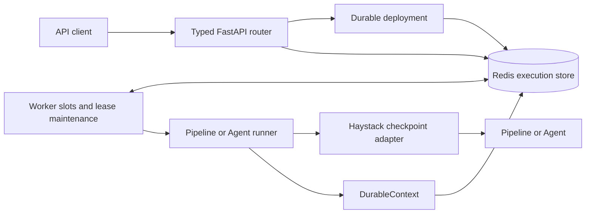
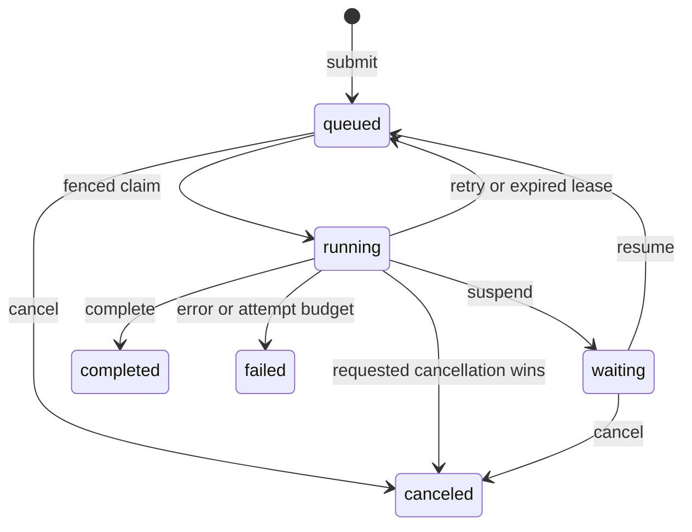

# Durable Execution

Durable execution lets a typed Haystack Pipeline or Agent continue after the
HTTP request has returned and recover after a Hayhooks process restart. Redis
stores the execution state; workers can resume from explicit checkpoints
without restarting completed Pipeline work or an Agent loop from the beginning.

Install the optional dependencies and start Redis 6.2 or newer:

```bash
pip install "hayhooks[durable]"
docker compose -f examples/durable-compose.yaml up -d
```

Durable execution requires Haystack 3.1 or newer. Use the memory store only for
tests and local development; it does not survive process loss.

## Design goals

The engine is deliberately focused on long-running Haystack work:

- **Stay close to Haystack.** Pipeline snapshots and Agent state are the
  checkpoint model; authors do not have to rewrite their application as a
  separate workflow DSL.
- **Embed cleanly.** Hayhooks manages the engine automatically, while another
  FastAPI application can use the same runtime, store, and router directly.
- **Recover safely across replicas.** Atomic transitions, leases, and fencing
  prevent an expired worker from committing after another worker has taken over.
- **Keep the operational footprint small.** A Python service and Redis provide
  the API, workers, scheduling indexes, checkpoints, retention, and recovery.

This is not transparent persistence of an arbitrary Python call stack. Authors
choose meaningful checkpoint boundaries, and external side effects must be
idempotent because execution is at least once.

## Features

| Capability | Behavior |
|---|---|
| Detached execution | Submission returns `202` while work continues in worker slots |
| Restart recovery | Redis-backed work is reclaimed after an expired lease |
| Pipeline checkpoints | Resume from one selected component boundary or a Haystack failure snapshot |
| Agent checkpoints | Restore Agent state around continuing tool and LLM loops |
| Retry control | Separate budgets for crash recovery and retries requested by application code |
| Human-in-the-loop | Persist a public wait reason and continue with typed resume input |
| Cancellation | Cooperative cancellation with a durable terminal result |
| Client recovery | Inspect authoritative state or reconnect an SSE stream with `Last-Event-ID` |
| Safe submission retries | Caller-supplied idempotency keys reject conflicting work |
| Multi-replica safety | Revision-aware claims, renewable leases, and monotonic fences |
| Bounded storage | Limits for admission, payloads, progress, stream chunks, and terminal retention |

## Architecture



One `DurableDeployment` binds a name and immutable revision to a Pydantic
request model, a runner, a Haystack adapter, and an execution store.

1. The FastAPI router authenticates the caller, validates the request, and
   atomically stores a queued execution. An idempotency key can bind retries of
   the same submission to that execution.
2. A worker claims runnable work for its exact deployment revision. The claim
   receives a renewable lease and a fence number.
3. `DurableContext` checkpoints Pipeline or Agent state, application state,
   progress, waits, and retry decisions. Redis applies every lifecycle change
   atomically through the same state reducer used by the memory store.
4. A worker may commit only while it still owns the current fence. After a
   crash, lease maintenance requeues the execution or fails it when the run
   attempt budget is exhausted.
5. Inspection and SSE read Redis-backed state. They do not depend on the worker
   or client connection that originally submitted the work.

## Lifecycle



The state reducer is the lifecycle authority. Redis adds authoritative time,
runnable and lease indexes, atomic transactions, retention, and cross-process
recovery.

## Author a durable wrapper

A wrapper declares an immutable revision and implements exactly one durable
method. Its parameters are a `DurableContext` and a Pydantic request model. A
Pydantic resume model is optional.

```python
from haystack import Pipeline
from pydantic import BaseModel

from hayhooks import BasePipelineWrapper, DurableContext


class Request(BaseModel):
    value: int


class Approval(BaseModel):
    approved: bool


class PipelineWrapper(BasePipelineWrapper):
    durable_revision = "job-v1"
    durable_resume_model = Approval

    def setup(self) -> None:
        self.pipeline = Pipeline()

    async def run_durable_async(self, context: DurableContext, request: Request) -> dict:
        if not context.state.get("approved"):
            resume_input = context.resume_input
            if resume_input is None:
                await context.suspend({"kind": "approval", "message": "Continue?"})
            if not Approval.model_validate(resume_input).approved:
                raise ValueError("execution was rejected")
            context.state["approved"] = True
            await context.checkpoint()
        return {"value": request.value}
```

For a Pipeline, call
`context.run_pipeline[_async](data, checkpoint_at="component")`. The adapter
persists a Haystack `PipelineSnapshot` before that component and also saves a
snapshot supplied by `PipelineRuntimeError`. On recovery, completed components
are not run again.

For an Agent, call `context.run_agent[_async](...)`. The adapter restores Agent
state and checkpoints continuing loops after tools, on continuation exits, and
after the final run. See the tested
[durable Pipeline example](https://github.com/deepset-ai/hayhooks/tree/main/examples/durable_execution)
for approval, retry, cancellation, and checkpoint recovery.

## Reliability semantics

- **At least once:** a process can fail after an external effect and before its
  checkpoint. Use an idempotency key derived from the execution ID and logical
  step for every external write.
- **Two retry budgets:** an expired lease consumes a run attempt. Application
  code requests a bounded delayed retry with `context.retry(...)`. An ordinary
  unhandled application exception fails the execution; it is not automatically
  retried.
- **Cooperative cancellation:** call `context.check_cancelled()` around long
  operations. The engine cannot safely interrupt an arbitrary external call.
- **Buffered progress:** `report_progress` is persisted with the next
  checkpoint or terminal transition. Call `checkpoint` when progress must be
  durable immediately.
- **Display-only streaming:** SSE chunks are stored immediately but bounded and
  may be dropped without failing the execution. The terminal result remains the
  source of truth.

Queued, running, and waiting executions are pinned to their wrapper revision.
Workers claim only a matching revision, and Hayhooks rejects overwrite or
undeploy while live work exists. Terminal results remain readable until their
configured TTL.

## REST, SSE, and ownership

Each durable deployment exposes typed submit, inspect, cancel, resume, and
stream routes. Submission returns a random execution ID, `Location`, and links.
The request and resume models appear in OpenAPI. See the
[API reference](../reference/api-reference.md#durable-execution) for the route
and status-code contract.

SSE streams are reattachable with `Last-Event-ID`. A `gap` event means that the
requested bounded history has expired and the retained tail follows. A terminal
`completed`, `failed`, or `canceled` event contains the authoritative execution
projection.

Hayhooks itself uses bearer-ID access: possession of a random execution ID
grants access. An embedded FastAPI host should pass an `owner_id_dependency` to
`create_durable_router`. The host authenticates the request and returns a stable
user or tenant ID. The router scopes execution access and idempotency to that ID
and hides owner mismatches as `404`.

The portable package does not manage the host application. The host owns
runtime startup and shutdown, authentication, Redis client lifetime, and health
reporting. The [standalone FastAPI example](../examples/durable-fastapi.md)
shows the complete integration.

## Comparison with Temporal

Temporal is a general distributed workflow platform based on deterministic
[event-history replay](https://docs.temporal.io/workflows). Hayhooks durable
execution is a smaller engine designed specifically for Haystack work.

| | Hayhooks durable execution | Temporal |
|---|---|---|
| Best fit | Long-running Haystack Pipelines and Agents hosted in Python/FastAPI | General workflows spanning services, teams, and long periods |
| Recovery model | Explicit Pipeline/Agent snapshots in Redis | Deterministic workflow replay plus Activities |
| Included here | Typed REST, checkpoints, retries, waits, cancellation, SSE, ownership, revision fencing | These concerns are part of a broader workflow platform |
| Not offered here | Child workflows, durable timers and schedules, Signals/Queries/Updates, task-queue routing, search visibility, or multi-cluster operation | Provides these broader orchestration capabilities |
| Operational shape | Embed the runtime and operate Redis | Run or buy a separate Temporal Service and operate SDK workers |

Use Temporal when those orchestration features are requirements. Use the
Hayhooks engine when the durable unit is already a Pipeline or Agent and you
want restart recovery, human waits, retries, and reconnectable clients without
introducing a general workflow platform.

## Operations and limitations

Read [Durable Operations](../deployment/durable-operations.md) before changing
polling, leases, capacity, retention, or Redis persistence. It covers rollout,
recovery timing, monitoring, and incident response.

Long-running A2A execution, A2A task persistence, push delivery, and A2A resume
are not supported in this release. Existing A2A execution remains request-bound.
