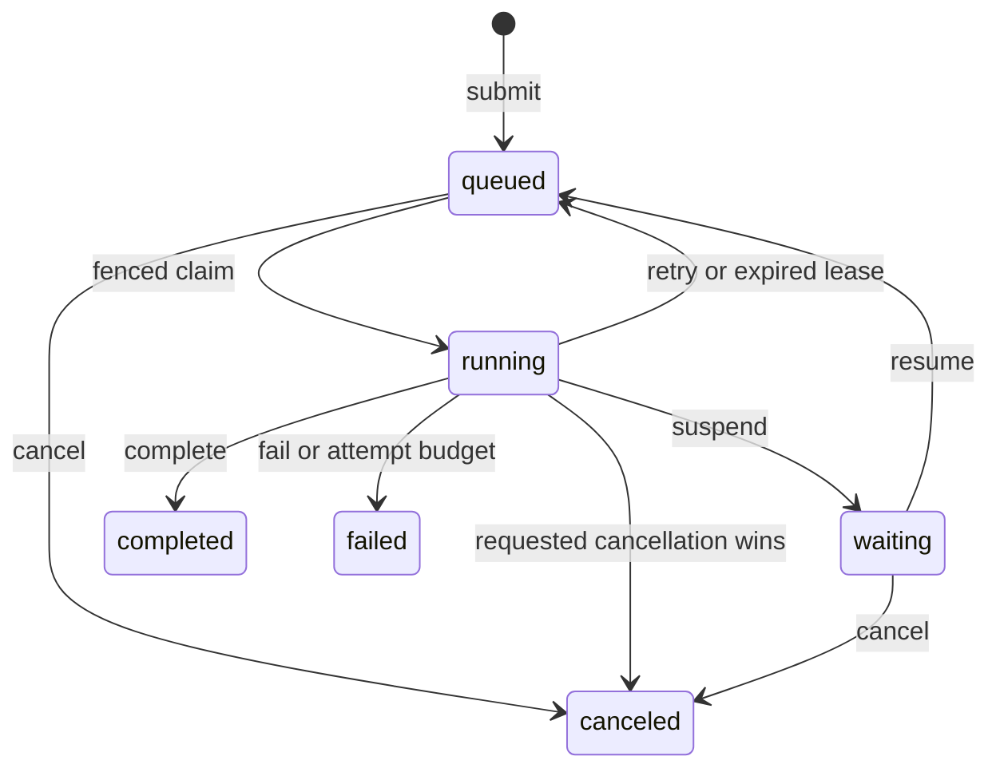

# Durable Execution

Durable execution runs a typed Pipeline or Agent after the submit request has
returned. Checkpoints, progress, retries, cancellation, waits, results, and
stream cursors survive a Hayhooks restart when Redis is used.

Install the durable dependencies and start Redis:

```bash
pip install "hayhooks[durable]"
docker compose -f examples/durable-compose.yaml up -d
```

## Lifecycle



The pure reducer is the only lifecycle authority. Memory and Redis stores apply
its transition plans atomically. Redis supplies authoritative time, runnable and
lease indexes, fencing, retention, and recovery across processes.

## Author a durable wrapper

A wrapper declares one immutable revision and implements exactly one durable
method. The first bound parameter is `DurableContext`; the second is any
Pydantic request model. An optional Pydantic resume model validates input sent
to the resume endpoint.

```python
from haystack import Pipeline
from pydantic import BaseModel

from hayhooks import BasePipelineWrapper, DurableContext


class Request(BaseModel):
    value: int


class Approval(BaseModel):
    approved: bool


class PipelineWrapper(BasePipelineWrapper):
    durable_revision = "job-v1"
    durable_resume_model = Approval

    def setup(self) -> None:
        self.pipeline = Pipeline()

    async def run_durable_async(self, context: DurableContext, payload: Request) -> dict:
        if not context.state.get("approved"):
            resume = context.resume_input
            if resume is None:
                await context.suspend({"kind": "approval", "message": "Continue?"})
            if not Approval.model_validate(resume).approved:
                raise ValueError("execution was rejected")
            context.state["approved"] = True
        await context.report_progress("Running")
        return {"value": payload.value}
```

Use `context.run_pipeline[_async](..., checkpoint_at="component")` for one
Pipeline component boundary. Agent wrappers use `context.run_agent[_async]`;
the adapter restores Agent state and checkpoints continuing tool/LLM loops.

## REST and SSE

Each durable wrapper adds typed routes under `/{pipeline_name}`. Submission
returns `202`, a random execution ID, a `Location` header, and links for inspect,
cancel, resume, and stream. See the [API reference](../reference/api-reference.md#durable-execution)
for the route and status-code contract.

SSE streams are reattachable with `Last-Event-ID`. Chunks are bounded,
attempt-tagged display data: they may be dropped without failing work. A `gap`
event means the requested cursor expired and the retained tail follows. The
terminal `completed`, `failed`, or `canceled` event contains the authoritative
execution projection.

## Ownership and embedding

Hayhooks uses unscoped bearer-ID access: possession of the random execution ID
grants access, and caller-provided idempotency keys are rejected. A standalone
FastAPI host can pass `owner_id_dependency` to `create_durable_router`. The host
authenticates the request and returns a stable, non-empty owner ID; the router
then scopes inspect, cancel, resume, stream, and idempotency to that owner while
hiding mismatches as `404`.

The portable `hayhooks.durable` package accepts an explicit store, deployment,
and runner and does not import the Hayhooks server. Hosts own runtime startup,
shutdown, authentication, and Redis client lifetime.

## Delivery and revisions

Execution is at least once. Fencing blocks stale workers from committing, but a
process can fail after an external effect and before its checkpoint. Make every
external write idempotent with a key derived from the execution ID and logical
step.

Queued, running, and waiting executions are pinned to their immutable wrapper
revision. Hayhooks rejects overwrite or undeploy with `409` while such work
exists. It does not drain work across revisions or force-delete live durable
state.

Long-running A2A execution, A2A task persistence, push delivery, and A2A resume
are not supported in this release. Existing A2A execution remains request-bound.

See the [durable execution](https://github.com/deepset-ai/hayhooks/tree/main/examples/durable_execution)
and [website stream](https://github.com/deepset-ai/hayhooks/tree/main/examples/durable_chat_with_website)
examples for retry, approval, checkpoints, cancellation, restart, and reconnect
flows.
