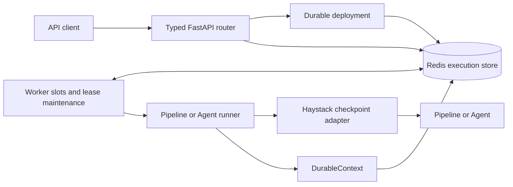
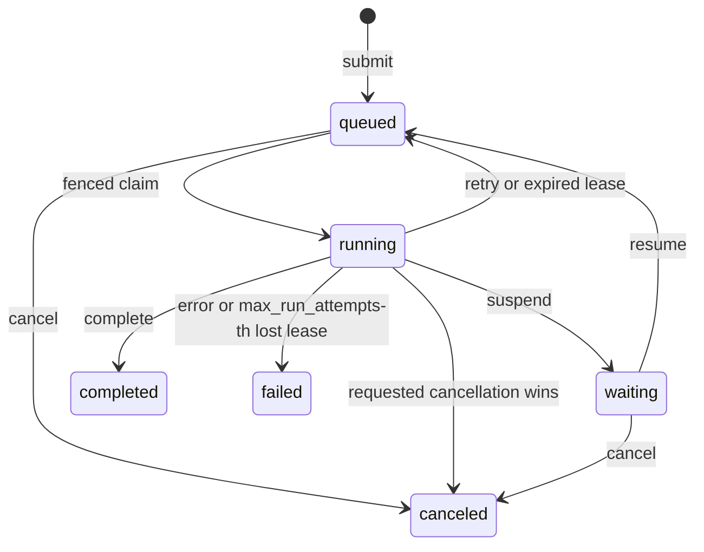

# Durable Execution

Durable execution lets a typed Haystack Pipeline or Agent continue after the
HTTP request has returned and recover after a process restart. Redis
stores the execution state; workers can resume from explicit checkpoints
without restarting completed Pipeline work or an Agent loop from the beginning.

Install the optional dependencies and start Redis 6.2 or newer, or Valkey 7.2 or newer:

```bash
pip install "hayhooks[durable]"
docker compose -f examples/durable-compose.yaml up -d
```

Durable execution requires Haystack 3.1 or newer. Use the memory store only for
tests and local development; it does not survive process loss.

There are two ways to host durable work:

- **Durable mode.** The Hayhooks server loads a fixed set of pipeline wrappers at
  startup and serves each durable wrapper with detached-execution routes. See
  [Durable mode](#durable-mode).
- **The portable engine.** Any asyncio application hosts it with
  `DurableDeployment`, `DurableRuntime`, an execution store, and, for FastAPI,
  `create_durable_router`. See [Write a durable runner](#write-a-durable-runner).

Live deployment, the default server mode, rejects a wrapper that implements
`run_durable` or `run_durable_async`: `422` over HTTP, and `PipelineModeError`
from Python, MCP, and server startup, which fails instead of skipping the
wrapper. The error names `HAYHOOKS_DURABLE_MODE`, the setting that serves it.

`import hayhooks.durable` and its core modules depend only on Pydantic, Loguru,
and the standard library. The integrations load on first use from their own
modules: `create_durable_router` needs FastAPI, `hayhooks.durable.haystack`
needs Haystack, and `hayhooks.durable.redis` needs Redis.

## Durable mode

Durable mode fixes the pipeline set when the server starts. Stage the complete
pipelines directory, then start the server with durable mode enabled:

```bash
docker compose -f examples/durable-compose.yaml up -d
export HAYHOOKS_DURABLE_MODE=true
hayhooks run --pipelines-dir examples/durable_execution/pipelines
```

A durable wrapper sets a `durable_revision` and implements exactly one of
`run_durable` or `run_durable_async`, taking a `DurableContext` and a Pydantic
request model:

```python
from haystack import Pipeline
from pydantic import BaseModel

from hayhooks import BasePipelineWrapper, DurableContext


class Request(BaseModel):
    value: int


class Result(BaseModel):
    value: int


class PipelineWrapper(BasePipelineWrapper):
    durable_revision = "jobs-v1"

    def setup(self) -> None:
        self.pipeline = Pipeline()

    async def run_durable_async(self, context: DurableContext, request: Request) -> Result:
        return Result(value=request.value * 2)
```

Each durable wrapper gets `POST /{name}/run-durable` and the execution routes
under `/{name}/executions/`. A wrapper that also implements `run_api` keeps its
ordinary `/{name}/run` endpoint, which still runs synchronously; durable mode
never reroutes ordinary requests. Set `durable_resume_model` to accept typed
resume input. The [durable execution example](https://github.com/deepset-ai/hayhooks/tree/main/examples/durable_execution)
covers checkpoints, retries, approval, and cancellation.

### What durable mode changes

| | Default mode | Durable mode |
|---|---|---|
| Pipeline set | Startup directory plus live deploy/undeploy | The startup directory, fixed until restart |
| Deploy/undeploy HTTP routes | Available | Absent, including from OpenAPI (`404`) |
| MCP `deploy_pipeline`/`undeploy_pipeline` tools | Available | Neither listed nor callable |
| Python deployment helpers | Available | Raise `PipelineModeError` before any side effect |
| Durable wrappers | Rejected | Served by the main HTTP server |
| Startup | `HAYHOOKS_STARTUP_DEPLOY_*` strategy; failing pipelines are skipped | Sequential, and any failure stops startup |
| Source directory | Deployments may write to it | Never written, including automatic bytecode |

Ordinary run, OpenAI-compatible, streaming, file, dashboard, and Chainlit
endpoints behave the same in both modes. `GET /status` reports `durable_mode`,
so clients can tell which kind of server they are talking to.

Remote CLI commands such as `hayhooks pipeline deploy-files` stay available
whatever the local setting is: the target server decides. Against a
durable-mode server they fail with `404 Not Found`, because the deployment
endpoints do not exist there.

### Startup

Startup loads every entry of `HAYHOOKS_PIPELINES_DIR` and fails if any of them
fails, so a typo never becomes a silently missing pipeline:

- The directory must exist and be readable; an empty directory is valid.
- Top-level `.yml`/`.yaml` files are YAML pipelines, and first-level
  directories are wrapper pipelines. A directory without `pipeline_wrapper.py`
  fails startup, including a leftover one that holds only `__pycache__`. Entries starting with a dot and `__pycache__` are skipped;
  other files are ignored.
- Names are the file stem or directory name, restricted to letters, digits,
  `_`, and `-`. Two definitions with the same name, or a name whose routes a
  server route or mount would shadow (such as `status` or the dashboard path),
  fail startup.
- `files_to_ignore_patterns` and the startup deployment strategy settings do
  not apply.

A failed startup exits the process: fix the pipeline and restart. To change the
pipeline set, replace the directory and restart or replace the process. Ordinary
wrappers need neither Redis nor the durable extra; the server creates its
durable runtime and Redis clients only when at least one durable wrapper is
loaded.

### Imports and source files

Wrapper packages load under a private import root, `_hayhooks_registry`, instead
of their public names, and their directories are not added to `sys.path`. Use
relative imports for wrapper-local modules (`from .helpers import tool`), and
installed packages or `HAYHOOKS_ADDITIONAL_PYTHON_PATH` for shared code. A
pipeline can therefore be named after a real module, such as `json`, without
shadowing it.

The module path of a pipeline's wrapper depends only on its name, never on the
source location, so checkpoints written before a restart or a move of the
source still resolve. The server logs each wrapper module at startup, and
`hayhooks.server.pipelines.loader.registry_module_name(name)` returns it.
Haystack's deserialization allowlist treats a name as a prefix, so allowlist
the pipeline's package, the module path without `.pipeline_wrapper`, to cover
the wrapper and its wrapper-local modules such as `helpers`:

```bash
export HAYSTACK_DESERIALIZATION_ALLOWLIST="_hayhooks_registry.p_6a6f6273"
```

Durable mode sets `sys.dont_write_bytecode` for the whole process before
loading, so neither the wrappers nor anything they import later write
`__pycache__` files into the source tree. Existing bytecode is still read.
Hayhooks is not a sandbox, though: wrapper code can write files deliberately.
Serve production pipelines from an immutable image or a read-only, versioned
mount.

Run one durable-mode app per process. The import root, the bytecode policy,
and the dashboard trace stream are process-wide, so building a second app in
the same process replaces the first app's pipeline modules. Standalone
`hayhooks mcp run` and `hayhooks a2a run` also honor `HAYHOOKS_DURABLE_MODE`:
they load the directory the same way and serve its ordinary pipelines, but a
durable wrapper fails their startup, since only the main HTTP server runs
durable workers.

### Revisions

`durable_revision` is a compatibility key chosen by the wrapper author, not a
code hash. Keep it across edits whose workers can still continue existing
inputs and checkpoints, and change it only when they cannot. Claims and resumes
require an exact match, so after a change, nonterminal work of the old revision
needs a process that still serves it. The pipeline name and the module paths of
serialized symbols are part of the same contract: renaming either is a
definition change for persisted work. Keep unrelated deployments apart with
names or `HAYHOOKS_DURABLE_REDIS_KEY_PREFIX`, not with the import root.

## Design goals

The engine is deliberately focused on long-running Haystack work:

- **Stay close to Haystack.** Pipeline snapshots and Agent state are the
  checkpoint model; authors do not have to rewrite their application as a
  separate workflow DSL.
- **Embed cleanly.** Any asyncio application can host the runtime and store
  without the Hayhooks server; a FastAPI host adds the typed router.
- **Recover safely across replicas.** Atomic transitions, leases, and fencing
  prevent an expired worker from committing after another worker has taken over.
- **Keep the operational footprint small.** A Python service and Redis provide
  the API, workers, scheduling indexes, checkpoints, retention, and recovery.

This is not transparent persistence of an arbitrary Python call stack. Authors
choose meaningful checkpoint boundaries, and external side effects must be
idempotent because execution is at least once.

## Features

| Capability | Behavior |
|---|---|
| Detached execution | Submission returns `202` while work continues in worker slots |
| Restart recovery | Redis-backed work is reclaimed after an expired lease |
| Pipeline checkpoints | Resume from one selected component boundary or a Haystack failure snapshot |
| Agent checkpoints | Restore Agent state around continuing tool and LLM loops |
| Retry control | Separate budgets for crash recovery and retries requested by application code |
| Human-in-the-loop | Persist a public wait reason and continue with typed resume input |
| Cancellation | Cooperative cancellation with a durable terminal result |
| Client recovery | Inspect authoritative state or reconnect an SSE stream with `Last-Event-ID` |
| Safe submission retries | Caller-supplied idempotency keys reject conflicting work |
| Multi-replica safety | Revision-aware claims, renewable leases, and monotonic fences |
| Bounded storage | Limits for admission, payloads, progress, stream chunks, and terminal retention |

## Architecture


```mermaid
flowchart LR
    Client[API client] --> Router[Typed FastAPI router]
    Router --> Deployment[Durable deployment]
    Deployment --> Store[(Redis execution store)]
    Workers[Worker slots and lease maintenance] <--> Store
    Workers --> Runner[Pipeline or Agent runner]
    Runner --> Adapter[Haystack checkpoint adapter]
    Adapter --> Haystack[Pipeline or Agent]
    Runner --> Context[DurableContext]
    Context --> Store
    Router --> Store
```

One `DurableDeployment` binds a name and immutable revision to a Pydantic
request model, a runner, a Haystack adapter, and an execution store.

1. The FastAPI router authenticates the caller, validates the request, and
   atomically stores a queued execution. An idempotency key can bind retries of
   the same submission to that execution.
2. A worker claims runnable work for its exact deployment revision. The claim
   receives a renewable lease and a fence number.
3. `DurableContext` checkpoints Pipeline or Agent state, application state,
   progress, waits, and retry decisions. Redis applies every lifecycle change
   atomically through the same state reducer used by the memory store.
4. A worker may commit only while it still owns the current fence. Each
   worker-owned Redis write, including heartbeats and stream chunks, re-checks
   ownership and Redis time against the lease inside one script before it
   writes. After a crash, lease maintenance requeues the execution or fails it
   on its `max_run_attempts`-th lost lease.
5. Inspection and SSE read Redis-backed state. They do not depend on the worker
   or client connection that originally submitted the work.

## Lifecycle


```mermaid
stateDiagram-v2
    [*] --> queued: submit
    queued --> running: fenced claim
    queued --> canceled: cancel
    running --> queued: retry or expired lease
    running --> waiting: suspend
    running --> completed: complete
    running --> failed: error or max_run_attempts-th lost lease
    running --> canceled: requested cancellation wins
    waiting --> queued: resume
    waiting --> canceled: cancel
```

The state reducer is the lifecycle authority. Redis adds authoritative time,
runnable and lease indexes, atomic transactions, retention, and cross-process
recovery.

## Write a durable runner

A runner takes a `DurableContext` and a validated Pydantic request. A
deployment binds it to a name, an immutable revision, and a store; a Pydantic
resume model is optional.

```python
from haystack import Pipeline
from pydantic import BaseModel

from hayhooks.durable import DurableContext, DurableDeployment, DurableRuntime
from hayhooks.durable.haystack import HaystackDurableAdapter


class Request(BaseModel):
    value: int


class Approval(BaseModel):
    approved: bool


async def run(context: DurableContext, request: Request) -> dict:
    if not context.state.get("approved"):
        resume_input = context.resume_input
        if resume_input is None:
            await context.suspend({"kind": "approval", "message": "Continue?"})
        if not Approval.model_validate(resume_input).approved:
            raise ValueError("execution was rejected")
        context.state["approved"] = True
        await context.checkpoint()
    return {"value": request.value}


adapter = HaystackDurableAdapter(Pipeline())
deployment = DurableDeployment(
    "jobs", "jobs-v1", store, Request, run, kind=adapter.kind, resume_model=Approval, adapter=adapter
)
runtime = DurableRuntime((deployment,))
```

`context.resume_input` returns the resume input on its first read and `None`
afterwards, so read it once into a variable, as above.

For a Pipeline, call
`context.run_pipeline[_async](data, checkpoint_at="component")`. The adapter
persists a Haystack `PipelineSnapshot` before that component and also saves a
snapshot supplied by `PipelineRuntimeError`. On recovery, completed components
are not run again.

For an Agent, call `context.run_agent[_async](...)`. The adapter restores Agent
state and checkpoints continuing loops after tools, on continuation exits, and
after the final run. Resume `messages` are applied even when the Agent suspended
before its first step checkpoint.

`context.retry()` / `retry_sync()` and `context.suspend()` / `suspend_sync()`
work inside Pipeline components and Agent tools. Their control signals are not
`Exception` subclasses, so `except Exception` does not intercept them; never
catch `BaseException` around durable calls. A retry from a component resumes at
the last explicit checkpoint and re-runs later components. A retry from a tool
resumes at the last Agent step checkpoint.

The adapter methods also take the context explicitly, so a runner can build its
own `HaystackDurableAdapter` for each execution, for example from a Pipeline
definition carried in the request, and call `adapter.run_pipeline_async(context,
data)`. The deployment then needs no shared adapter, and a new deployment
instance with the same name and revision completes queued executions and resumes
waiting ones with their original definition. The
[standalone FastAPI example](../examples/durable-fastapi.md) runs a complete
Pipeline with approval, checkpoint recovery, and cancellation.

## Reliability semantics

- **At least once:** a process can fail after an external effect and before its
  checkpoint. Use an idempotency key derived from the execution ID and logical
  step for every external write.
- **Two retry budgets:** `max_run_attempts` bounds lost leases, so an execution
  fails on its Nth expired lease. Graceful handoffs, resumes, and
  `context.retry()` do not count toward it. `max_application_retries` bounds
  `context.retry()` separately, while `attempt` numbers every claim. While a
  retry is waiting, its public error is the retryable `RetryRequestedError`.
  Exhausting the budget fails the run with `ApplicationRetriesExhaustedError`
  and code `application_retries_exhausted`. The message passed to `retry()` is
  logged and never stored. An ordinary unhandled application exception fails
  the execution; it is not automatically retried.
- **Cooperative cancellation:** call `context.check_cancelled()` around long
  operations. The engine cannot safely interrupt an arbitrary external call.
- **Bounded lease ownership:** the local lease window starts before the claim
  request. A worker stops treating the claim as its own once
  `lease_duration_ms - lease_commit_safety_ms` passes without store
  confirmation, regardless of socket timeouts. Preparation reads and pre-start
  failure or release writes use the same bound, so a hung preparation frees its
  worker slot on expiry and never starts user code. Durable calls then raise
  `ExecutionLeaseLostError`; async applications are cancelled, and thread work
  fails at its next durable call. Embedders should still set a worker-client
  `socket_timeout` so half-open connections fail promptly.
- **Store error retries:** heartbeats and commits retry transient store errors,
  from `operational_backoff_min_seconds` up to
  `operational_backoff_max_seconds`, until the lease window ends. A commit whose
  reply was lost may log lease loss even when it landed; the stored status is
  authoritative.
- **Contained thread exits:** `SystemExit`, `KeyboardInterrupt`,
  `GeneratorExit`, `StopIteration`, and `StopAsyncIteration` from a synchronous
  runner or adapter thread fail the run as `RuntimeError`; the host keeps
  running.
- **Invalid stored data:** unreadable or invalid claimed input, checkpoint, or
  progress data fails with a publicly readable `stored_execution_invalid`
  error. Guarded recovery may discard unusable progress, and corrupt
  best-effort chunks cannot block terminal recovery or capacity release.
  Claims and maintenance instead remove undecodable controls from scheduling
  indexes, log an error with the execution ID, and leave those records for
  operator cleanup.
- **Cancellation errors:** `DurableExecutionCancelledError` without a pending
  cancellation request fails the run. With a pending request, cancellation
  still wins and the run ends `canceled`.
- **Buffered progress:** `report_progress` is persisted with the next
  checkpoint or terminal transition. Call `checkpoint` when progress must be
  durable immediately.
- **Display-only streaming:** streaming callbacks check ownership, encode and
  queue chunks in the calling thread, and never wait for Redis or the event
  loop. The first chunk after a quiet period flushes immediately; later chunks
  flush at most once per 100 ms while work is pending, and always before the run
  leaves `running`. Buffer size and pending wake-ups stay bounded even when the
  event loop stalls. Chunks may be dropped without failing the execution, so
  the terminal result remains the source of truth.

Queued, running, and waiting executions are pinned to their deployment
revision, and workers claim only a matching revision. Change the revision only
for incompatible runner or Pipeline behavior, and keep serving the old revision
until its live work drains. Terminal results remain readable until their
configured TTL.

## REST, SSE, and ownership

`create_durable_router(deployment, ...)` exposes typed submit, inspect,
cancel, resume, and stream routes. Submission returns a random execution ID, `Location`, and links.
The request and resume models appear in OpenAPI. See the
[API reference](../reference/api-reference.md#durable-execution) for the route
and status-code contract.

SSE streams are reattachable with `Last-Event-ID`. Viewers block on the chunk
stream and receive chunks as soon as a worker flushes them. A `gap` event means
that the requested bounded history has expired and the retained tail follows. A
terminal `completed`, `failed`, or `canceled` event contains the authoritative
execution projection. A stream that ends without a terminal event, for example
when its deployment closes, can be resumed with its last cursor on any
replica.

Without an owner dependency, the router uses bearer-ID access: possession of a
random execution ID grants access. A multi-user host should pass an
`owner_id_dependency` to `create_durable_router`. The host authenticates the request and returns a stable
user or tenant ID. The router scopes execution access and idempotency to that ID
and hides owner mismatches as `404`.

An idempotency key binds the deployment, owner, and request fields that the
client actually sent. Unset defaults and the deployment revision are excluded,
so a replay during a rolling deploy returns the existing execution and adding
an optional field does not break clients that omit it. Sending a field
explicitly, even with its default value, is a different request and returns
`409`. Without an owner dependency, every caller shares one idempotency-key
namespace; use unguessable keys such as UUIDs.

## Host lifecycle

The portable package does not manage the host application. The host owns
runtime startup and shutdown, authentication, Redis client lifetime, and health
reporting. The [standalone FastAPI example](../examples/durable-fastapi.md)
shows the complete integration; durable mode follows the same sequence in the
Hayhooks server's lifespan.

- **Fixed membership.** Pass every deployment to `DurableRuntime(...)` when you
  construct it; a runtime cannot add or remove deployments. A host that binds
  its pipeline late constructs the runtime at that moment.
- **One-way lifecycle.** `start()` opens admission once and does nothing while
  already active. `quiesce()` and `close()` stop a deployment for good, and a
  later `start()` raises: use a new instance for a new lifecycle. When
  `runtime.start()` fails, it closes every deployment and re-raises.
- **Close, then drain.** `close()` stops admission, ends open streams, and gives
  workers `shutdown_grace_seconds` to finish; it then cancels async work that is
  still running and waits up to another grace period for it to stop. Repeated
  calls share that deadline instead of starting a new one. `close()` can return while retained work
  still runs, so a host that owns a shared Redis client awaits `wait_drained()`
  after `close()`, even when `close()` raised, and only then closes the client.
  Cancelling that wait does not cancel the work, and the wait can be repeated.
- **Stopped work is handed back.** Async work that stops in response to
  cancellation at the end of the grace releases its claim: its buffered chunks
  are flushed, and the run returns to the queue
  without counting toward `max_run_attempts`; the next claim is a new `attempt`,
  so another process can claim it immediately. Progress since the last
  checkpoint is lost, as after a crash. A pending cancellation wins, and the
  run ends `canceled`.
  A coroutine that suppresses cancellation or awaits cleanup keeps its claim,
  heartbeats, and context access until it exits; `wait_drained()` waits for it.
  An exception raised during shutdown cleanup also hands the claim back.
  If release outlasts the close deadline, `wait_drained()` waits for that release.
- **Thread-backed work keeps its claim.** Python cannot interrupt a thread, so
  a synchronous runner, or a Pipeline thread started by `run_pipeline_async`,
  keeps its claim, heartbeats, and Redis access after `close()`, and
  `wait_drained()` waits for it to exit. Once its last Pipeline thread exits, an
  async runner receives cancellation; it cannot start new engine threads after
  the shutdown grace expires. If the host cancels a worker task
  directly, its heartbeat stops, so that claim is handed back as well.

```python
@asynccontextmanager
async def lifespan(_app: FastAPI):
    try:
        await runtime.start()
        yield
    finally:
        try:
            await runtime.close()
        finally:
            await runtime.wait_drained()
            await redis.aclose()
```

In durable mode, the server reports readiness only after every durable
deployment has started. On shutdown it closes them all, even when one fails,
waits for retained work to drain, and only then closes its Redis clients:
retained work keeps Redis and the event loop until it no longer owns a claim.
Graceful shutdown can therefore outlast `HAYHOOKS_DURABLE_SHUTDOWN_GRACE_SECONDS`,
which is the grace before cancelling workers, not a bound on shutdown. The
server logs while it waits. When a hard deadline is required, terminate the
process externally, or set `HAYHOOKS_DURABLE_RELEASE_RUNNING_ON_SHUTDOWN=true`
(below); forced termination resumes through lease and checkpoint recovery and
cannot promise exactly-once external side effects.

The server uses two Redis clients built from `HAYHOOKS_DURABLE_REDIS_URL`: one
for workers, and one for SSE viewers, whose connection pool of
`HAYHOOKS_DURABLE_REDIS_MAX_VIEWERS` connections bounds the concurrent durable
streams per process. Durable routes use bearer-ID access; put authentication in
front of the server for multi-user deployments.

### Hosts with short kill deadlines

A platform that kills the process shortly after SIGTERM, such as Kubernetes with
its default 30-second grace period, can cut retained threads off before they
finish, leaving their runs to wait for lease expiry. Set
`RuntimeConfig(release_running_on_close=True)`, or
`HAYHOOKS_DURABLE_RELEASE_RUNNING_ON_SHUTDOWN=true` in durable mode, to hand
those runs over as well:
at the end of the shutdown grace, `close()` releases the claims of threads that
are still running. `wait_drained()` then returns once every claim is finished or
released, without waiting for released threads, and the host can close Redis.

A released thread keeps running user code until its next durable call
(`checkpoint`, `report_progress`, `check_cancelled`, `stream_chunk`, `retry`, or
`suspend`), which raises `ExecutionLeaseLostError` without touching Redis; the
lease guard rejects any write already in flight. Until that call, its LLM and
tool calls can overlap with the process that took the run over. Writes cannot
overlap, which keeps the at-least-once contract. Engine threads are daemon
threads, but Python waits at interpreter exit for threads a runner starts
itself, such as `asyncio.to_thread` executor threads; the orchestrator's kill
deadline bounds that delay.

## Comparison with Temporal

Temporal is a general distributed workflow platform based on deterministic
[event-history replay](https://docs.temporal.io/workflows). Hayhooks durable
execution is a smaller engine designed specifically for Haystack work.

| | Hayhooks durable execution | Temporal |
|---|---|---|
| Best fit | Long-running Haystack Pipelines and Agents hosted in Python/FastAPI | General workflows spanning services, teams, and long periods |
| Recovery model | Explicit Pipeline/Agent snapshots in Redis | Deterministic workflow replay plus Activities |
| Included here | Typed REST, checkpoints, retries, waits, cancellation, SSE, ownership, revision fencing | These concerns are part of a broader workflow platform |
| Not offered here | Child workflows, durable timers and schedules, Signals/Queries/Updates, task-queue routing, search visibility, or multi-cluster operation | Provides these broader orchestration capabilities |
| Operational shape | Embed the runtime and operate Redis | Run or buy a separate Temporal Service and operate SDK workers |

Use Temporal when those orchestration features are requirements. Use the
Hayhooks engine when the durable unit is already a Pipeline or Agent and you
want restart recovery, human waits, retries, and reconnectable clients without
introducing a general workflow platform.

## Operations and limitations

Read [Durable Operations](../deployment/durable-operations.md) before changing
polling, leases, capacity, retention, or Redis persistence. It covers rollout,
recovery timing, monitoring, and incident response.

Long-running A2A execution, A2A task persistence, push delivery, and A2A resume
are not supported in this release. Existing A2A execution remains request-bound.
