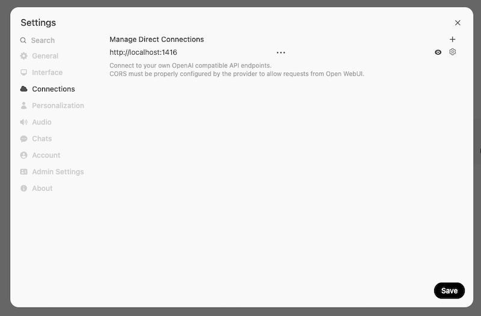
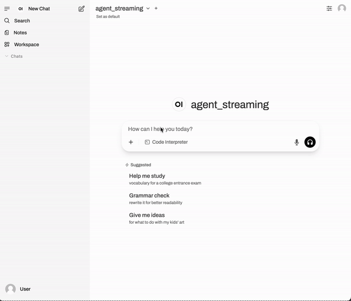

# Open WebUI Integration

Hayhooks provides seamless integration with [Open WebUI](https://openwebui.com/), enabling you to use Haystack pipelines and agents as chat completion backends with full feature support.

## Overview

Open WebUI integration allows you to:

- Use Haystack pipelines as OpenAI-compatible chat backends
- Support streaming responses in real-time
- Send status events to enhance user experience
- Intercept tool calls for better feedback

## Getting Started

### Prerequisites

- Open WebUI instance running
- Hayhooks server running
- Pipeline with chat completion support

### Configuration

#### 1. Install Open WebUI

Please follow the [Open WebUI installation guide](https://docs.openwebui.com/getting-started/quick-start) to install Open WebUI.

We recommend [using Docker to install Open WebUI](https://docs.openwebui.com/getting-started/quick-start/#quick-start-with-docker-).

A quick command to install Open WebUI using Docker is:

```bash
docker run -d -p 3000:8080 --add-host=host.docker.internal:host-gateway -e WEBUI_AUTH=False -v open-webui:/app/backend/data --name open-webui ghcr.io/open-webui/open-webui:main
```

This will start Open WebUI on local port 3000, with no authentication, and with the data stored in the `open-webui` volume. It's the easiest way to get started.

#### 2. Disable Auto-generated Content

Open WebUI automatically generates content for your pipelines. More precisely, it calls your pipelines to generate tags, title and follow-up messages. Depending on your pipeline, this may not be suitable for this use case.

We recommend disabling those features as a starting point, then you can enable them if you need them.

Go to **Admin Settings → Interface** and turn off the following features:


#### 3. Add Hayhooks as an OpenAI compatible API endpoint

You have two options to connect Hayhooks to Open WebUI:

##### Option 1: Direct Connection (Recommended)

First, enable **Direct Connections** in Open WebUI.

Go to **Admin Settings → Connections** and enable **Direct Connections**:


Then go to **Settings → Connections** and add a new connection:

- **API Base URL**: `http://localhost:1416`
- **API Key**: `any-value` (or leave it empty, it's not used by Hayhooks)



##### Option 2: OpenAI API Connection

Alternatively, you can add Hayhooks as an additional **OpenAI API Connection** from **Admin Settings → Connections**:


In both cases, remember to **fill a random value as API key** (Hayhooks doesn't require authentication).

## Pipeline Implementation

To make your pipeline work with Open WebUI, implement the `run_chat_completion` or `run_chat_completion_async` method in your `PipelineWrapper`. See the [OpenAI Compatibility](openai-compatibility.md) guide for detailed implementation examples.

### Non-Streaming Example

Here's how a non-streaming chat completion looks in Open WebUI:


### Streaming Example

With streaming enabled, responses appear in real-time:


## Open WebUI Events

Hayhooks supports sending events to Open WebUI for enhanced user experience:

### Available Events

- **status**: Show progress updates and loading indicators
- **message**: Append content to the current message
- **replace**: Replace the current message content entirely
- **notification**: Show toast notifications (info, success, warning, error)
- **source**: Add references, citations, or code execution results

!!! warning "Limitations"
    Customizing your Pipeline wrapper to emit Open WebUI Events may break out-of-the-box compatibility with [Haystack's `OpenAIChatGenerator`](../features/openai-compatibility.md#using-hayhooks-with-haystacks-openaichatgenerator).
    Your pipeline will still function normally, but it may not be directly consumable through `OpenAIChatGenerator`.

### Event Implementation

```python
from typing import AsyncGenerator
from hayhooks import async_streaming_generator, get_last_user_message, BasePipelineWrapper
from hayhooks.open_webui import create_status_event, create_message_event, OpenWebUIEvent

class PipelineWrapper(BasePipelineWrapper):
    async def run_chat_completion_async(self, model: str, messages: list[dict], body: dict) -> AsyncGenerator[str | OpenWebUIEvent, None]:
        # Indicate loading
        yield create_status_event("Processing your request...", done=False)

        question = get_last_user_message(messages)

        try:
            # Stream model output alongside events
            result = async_streaming_generator(
                pipeline=self.pipeline,
                pipeline_run_args={"prompt_builder": {"query": question}},
            )

            # Optional UI hint
            yield create_message_event("✍️ Generating response...")

            async for chunk in result:
                yield chunk

            yield create_status_event("Request completed successfully", done=True)
        except Exception as e:
            yield create_status_event("Request failed", done=True)
            yield create_message_event(f"Error: {str(e)}")
            raise
```

Here's how Open WebUI events enhance the user experience:


## Tool Call Interception

For agent pipelines, you can intercept tool calls to provide real-time feedback:

```python
def on_tool_call_start(tool_name: str, arguments: dict, tool_id: str):
    """Called when a tool call starts"""
    print(f"Tool call started: {tool_name}")


def on_tool_call_end(tool_name: str, arguments: dict, result: dict, error: bool):
    """Called when a tool call ends"""
    print(f"Tool call ended: {tool_name}, Error: {error}")


class PipelineWrapper(BasePipelineWrapper):
    def run_chat_completion(self, model: str, messages: list[dict], body: dict) -> Generator:
        return streaming_generator(
            pipeline=self.pipeline,
            pipeline_run_args={"messages": messages},
            on_tool_call_start=on_tool_call_start,
            on_tool_call_end=on_tool_call_end,
        )
```

Here's an example of tool call interception in action:




## Streaming the Final Pipeline Output

The `on_pipeline_end` callback lets you customize what happens after a pipeline finishes running when using `streaming_generator` or `async_streaming_generator`.
You can use it to return the final output of the pipeline, or add additional information (e.g. adding sources).

Here’s how you can define and use `on_pipeline_end`:

```python
def on_pipeline_end(result: dict):
    """Called after the pipeline completes. Can format or summarize results."""
    documents = result.get("documents", [])
    references_str = "\n\n### All Sources:\n"
    if documents:
        for idx, doc in enumerate(documents):
            references_str += f"- [{idx + 1}] {doc.meta['url']}\n"
    return references_str

class PipelineWrapper(BasePipelineWrapper):
    def run_chat_completion(self, model: str, messages: list[dict], body: dict) -> Generator:
        return streaming_generator(
            pipeline=self.pipeline,
            pipeline_run_args={"messages": messages},
            on_pipeline_end=on_pipeline_end,
        )
```

With this setup, after the pipeline finishes, the `on_pipeline_end` function is called with the pipeline’s result.
You can use it to append a list of sources, add a summary, or perform any other final formatting.
This final output is then sent to Open WebUI as part of the chat response.

Here’s an example of post-processing with `on_pipeline_end` in action:


## OpenAPI Tool Server

Hayhooks can serve as an [OpenAPI Tool Server](https://docs.openwebui.com/openapi-servers/) for Open WebUI, exposing its core API endpoints as tools that can be used directly from the chat interface.

[OpenAPI Tool Servers](https://docs.openwebui.com/openapi-servers/) are a standard way to integrate external tools and data sources into LLM agents using the widely-adopted OpenAPI specification. This approach offers several advantages:

- **Standard Protocol**: Uses the established OpenAPI specification - no proprietary protocols to learn
- **Easy Integration**: If you build REST APIs today, you're already familiar with the approach
- **Secure**: Built on HTTP/REST with standard authentication methods (OAuth, JWT, API Keys)
- **Flexible Deployment**: Can be hosted locally or externally without vendor lock-in

Since Hayhooks exposes its OpenAPI schema at `/openapi.json`, Open WebUI can automatically discover and integrate all available Hayhooks endpoints as tools.

### Setup

1. Go to **Settings → Tools** in Open WebUI
2. Add OpenAPI Tool Server:
   - **Name**: Hayhooks
   - **URL**: `http://localhost:1416/openapi.json`


### Available Tools

Once configured, the following Hayhooks operations become available as tools in your Open WebUI chat:

- **Deploy Pipeline**: Deploy new pipelines from your chat interface
- **Undeploy Pipeline**: Remove existing pipelines
- **Run Pipeline**: Execute deployed pipelines with parameters
- **Get Status**: Check the status and list of all deployed pipelines

This enables you to manage your entire Hayhooks deployment directly through natural language conversations.

### Example: Deploy a Haystack pipeline from `open-webui` chat interface

Here's a video example of how to deploy a Haystack pipeline from the `open-webui` chat interface:


## Example: Chat with Website

Here's a complete example for a website chat pipeline:

```python
from typing import AsyncGenerator
from haystack import Pipeline
from haystack.components.fetchers import LinkContentFetcher
from haystack.components.converters import HTMLToDocument
from haystack.components.builders import ChatPromptBuilder
from haystack.components.generators.chat import OpenAIChatGenerator
from haystack.dataclasses import ChatMessage
from hayhooks import BasePipelineWrapper, async_streaming_generator, get_last_user_message

class PipelineWrapper(BasePipelineWrapper):
    def setup(self) -> None:
        fetcher = LinkContentFetcher()
        converter = HTMLToDocument()

        template = [
            ChatMessage.from_user(
                "Based on this content: {{documents}}\nAnswer: {{query}}"
            )
        ]
        chat_prompt_builder = ChatPromptBuilder(template=template)

        llm = OpenAIChatGenerator(model="gpt-4o")

        self.pipeline = Pipeline()
        self.pipeline.add_component("fetcher", fetcher)
        self.pipeline.add_component("converter", converter)
        self.pipeline.add_component("chat_prompt_builder", chat_prompt_builder)
        self.pipeline.add_component("llm", llm)
        self.pipeline.connect("fetcher.content", "converter")
        self.pipeline.connect("converter.documents", "chat_prompt_builder.documents")
        self.pipeline.connect("chat_prompt_builder.prompt", "llm.messages")

    async def run_chat_completion_async(self, model: str, messages: list[dict], body: dict) -> AsyncGenerator:
        question = get_last_user_message(messages)

        # Extract URLs from messages or use defaults
        urls = ["https://haystack.deepset.ai"]  # Default URL

        return async_streaming_generator(
            pipeline=self.pipeline,
            pipeline_run_args={
                "fetcher": {"urls": urls},
                "chat_prompt_builder": {"query": question}
            },
        )
```

## Troubleshooting

### Common Issues

1. **Connection Failed**
   - Verify Hayhooks server is running
   - Check API URL in Open WebUI settings
   - Ensure correct port (1416 by default)

2. **No Response**
   - Check if pipeline implements `run_chat_completion`
   - Verify pipeline is deployed
   - Check server logs for errors

3. **Streaming Not Working**
   - Ensure `streaming_callback` is set on generator
   - Check if `run_chat_completion_async` is implemented
   - Verify Open WebUI streaming is enabled

### Debug Commands

```bash
# Check Hayhooks status
hayhooks status

# Check deployed pipelines
curl http://localhost:1416/status

# Test chat completion endpoint (OpenAI-compatible)
curl -X POST http://localhost:1416/v1/chat/completions \
  -H 'Content-Type: application/json' \
  -d '{
    "model": "my_pipeline",
    "messages": [{"role": "user", "content": "test message"}],
    "stream": false
  }'

# Test streaming chat completion
curl -X POST http://localhost:1416/v1/chat/completions \
  -H 'Content-Type: application/json' \
  -d '{
    "model": "my_pipeline",
    "messages": [{"role": "user", "content": "test message"}],
    "stream": true
  }'
```

## Next Steps

- [OpenAI Compatibility](openai-compatibility.md) - Implementation details for chat completion methods
- [Open WebUI Events Example](../examples/openwebui-events.md) - Advanced UI integration patterns
