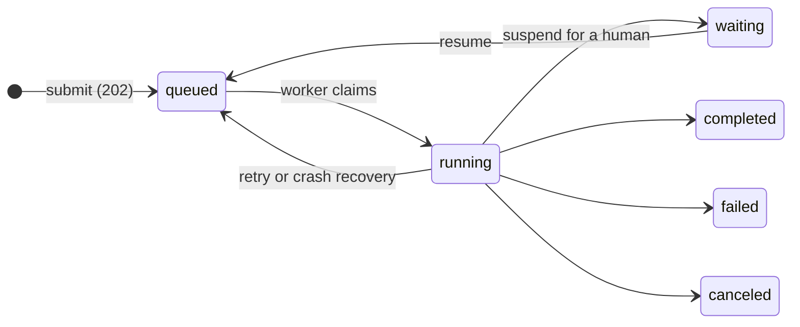

# Hayhooks

**Serve [Haystack](https://haystack.deepset.ai/) Pipelines and Agents as production APIs: REST, OpenAI-compatible chat, MCP, A2A, and durable executions that survive restarts.**

[](https://pypi.org/project/hayhooks)
[](https://pypi.org/project/hayhooks)
[](https://github.com/deepset-ai/hayhooks/actions/workflows/docker.yml)
[](https://github.com/deepset-ai/hayhooks/actions/workflows/tests.yml)

Write a small Python wrapper around your Pipeline or Agent, and Hayhooks turns it into typed endpoints, streaming chat backends, and agent-to-agent tools. When the work outlives a request, a restart, or a deploy, run it as a **durable execution**: checkpointed in Redis, resumable on any replica, and able to wait for a human.

[Get started](getting-started/quick-start.md){ .md-button .md-button--primary }
[Durable execution](#durable-execution){ .md-button }

<div class="grid cards" markdown>

-   :material-api:{ .lg .middle } **REST APIs from Python**

    ---

    Every wrapper or YAML pipeline becomes typed, validated endpoints with OpenAPI docs, [file uploads](features/file-upload-support.md), and custom routes.

-   :material-restore:{ .lg .middle } **Durable executions**

    ---

    Checkpoints, retries, human approval, cancellation, and restart recovery for long-running Pipelines and Agents.

    [:octicons-arrow-right-24: Durable execution](features/durable-execution.md)

-   :material-chat-processing:{ .lg .middle } **OpenAI-compatible chat**

    ---

    Streaming [chat completion](features/openai-compatibility.md) backends for [Open WebUI](features/openwebui-integration.md), or an embedded [Chainlit](features/chainlit-integration.md) UI with `--with-chainlit`.

-   :material-tools:{ .lg .middle } **MCP server**

    ---

    Each pipeline becomes an [MCP tool](features/mcp-support.md) in [Cursor](https://cursor.com), [Claude Desktop](https://claude.ai/download), or any MCP client.

-   :material-account-switch:{ .lg .middle } **A2A protocol**

    ---

    Publish pipelines as [A2A agents](features/a2a-support.md) with auto-generated agent cards, so other agents can delegate tasks to them.

-   :material-chart-timeline-variant:{ .lg .middle } **Tracing and dashboard**

    ---

    OpenTelemetry spans (`hayhooks[tracing]`) for deploy, run, and durable attempts, with a live `/dashboard` via `--with-tracing-dashboard`.

</div>

## Quick Start

### 1. Install Hayhooks

```bash
# Install Hayhooks
pip install hayhooks
```

### 2. Start Hayhooks

```bash
hayhooks run
```

### 3. Create a simple agent

Create a minimal agent wrapper with streaming chat support and a simple HTTP POST API:

```python
from typing import AsyncGenerator
from haystack.components.agents import Agent
from haystack.dataclasses import ChatMessage
from haystack.tools import Tool
from haystack.components.generators.chat import OpenAIChatGenerator
from hayhooks import BasePipelineWrapper, async_streaming_generator


# Define a Haystack Tool that provides weather information for a given location.
def weather_function(location):
    return f"The weather in {location} is sunny."

weather_tool = Tool(
    name="weather_tool",
    description="Provides weather information for a given location.",
    parameters={
        "type": "object",
        "properties": {"location": {"type": "string"}},
        "required": ["location"],
    },
    function=weather_function,
)

class PipelineWrapper(BasePipelineWrapper):
    def setup(self) -> None:
        self.agent = Agent(
            chat_generator=OpenAIChatGenerator(model="gpt-4o-mini"),
            system_prompt="You're a helpful agent",
            tools=[weather_tool],
        )

    # This will create a POST /my_agent/run endpoint
    # `question` will be the input argument and will be auto-validated by a Pydantic model
    async def run_api_async(self, question: str) -> str:
        result = await self.agent.run_async(messages=[ChatMessage.from_user(question)])
        return result["last_message"].text

    # This will create an OpenAI-compatible /chat/completions endpoint
    async def run_chat_completion_async(
        self, model: str, messages: list[dict], body: dict
    ) -> AsyncGenerator[str, None]:
        chat_messages = [
            ChatMessage.from_openai_dict_format(message) for message in messages
        ]

        return async_streaming_generator(
            pipeline=self.agent,
            pipeline_run_args={
                "messages": chat_messages,
            },
        )
```

Save as `my_agent_dir/pipeline_wrapper.py`.

### 4. Deploy it

```bash
hayhooks pipeline deploy-files -n my_agent ./my_agent_dir
```

### 5. Run it

Call the HTTP POST API (`/my_agent/run`):

```bash
curl -X POST http://localhost:1416/my_agent/run \
  -H 'Content-Type: application/json' \
  -d '{"question": "What can you do?"}'
```

Call the OpenAI-compatible chat completion API (streaming enabled):

```bash
curl -X POST http://localhost:1416/chat/completions \
  -H 'Content-Type: application/json' \
  -d '{
    "model": "my_agent",
    "messages": [{"role": "user", "content": "What can you do?"}]
  }'
```

Or chat with it in the [embedded Chainlit UI](features/chainlit-integration.md) (`hayhooks run --with-chainlit`) or [integrate it with Open WebUI](features/openwebui-integration.md)!

## Durable execution

Some work does not fit in a request: an Agent that researches for ten minutes, a Pipeline that must wait for a reviewer, a job that must not start over because you deployed. Durable execution runs a Pipeline or Agent detached from the request, checkpoints it in Redis, and resumes it from the last checkpoint on any replica.



| Capability | What you get |
|---|---|
| **Detached runs** | Submit returns `202 Accepted` with links to inspect, resume, cancel, and stream |
| **Restart recovery** | A crashed or redeployed worker's run is reclaimed and continues from its last checkpoint |
| **Pipeline and Agent checkpoints** | Completed components are not run again; Agent loops continue after their last tool call |
| **Human in the loop** | Suspend with a public wait reason and continue with typed, validated resume input |
| **Retries and cancellation** | Separate budgets for crashes and application retries; cooperative cancellation |
| **Live output** | Reattachable SSE streams (`Last-Event-ID`) that any replica can serve |
| **Multi-replica safety** | Leases and fencing stop a stale worker from committing after another took over |

A durable wrapper sets a revision and implements `run_durable_async`. This Agent waits for approval, then researches with its tools:

```python
from haystack.components.agents import Agent
from haystack.components.generators.chat import OpenAIChatGenerator
from haystack.dataclasses import ChatMessage
from haystack.tools import tool
from pydantic import BaseModel

from hayhooks import BasePipelineWrapper, DurableContext


@tool
def search(query: str) -> str:
    """Search the knowledge base."""
    return f"Hayhooks serves Haystack pipelines and agents; results for {query!r}."


class Task(BaseModel):
    question: str


class Approval(BaseModel):
    approved: bool


class Report(BaseModel):
    answer: str


class PipelineWrapper(BasePipelineWrapper):
    durable_revision = "research-agent-v1"  # in-flight work stays pinned to this revision
    durable_resume_model = Approval  # typed input for human-in-the-loop waits

    def setup(self) -> None:
        self.pipeline = Agent(chat_generator=OpenAIChatGenerator(model="gpt-4o-mini"), tools=[search])

    async def run_durable_async(self, context: DurableContext, task: Task) -> Report:
        # Wait for a human. The wait lives in Redis, so it survives restarts and deploys.
        if not context.state.get("approved"):
            decision = context.resume_input  # consumed on first read
            if decision is None:
                await context.suspend({"kind": "approval", "message": f"Research {task.question!r}?"})
            if not Approval.model_validate(decision).approved:
                raise ValueError("research was rejected")
            context.state["approved"] = True

        # Agent state is checkpointed after tool calls: recovery continues the loop.
        result = await context.run_agent_async(messages=[ChatMessage.from_user(task.question)])
        return Report(answer=result["last_message"].text)
```

=== "Serve"

    ```bash
    pip install "hayhooks[durable]"
    docker run -d -p 6379:6379 redis
    # Save the wrapper as ./pipelines/research_agent/pipeline_wrapper.py
    HAYHOOKS_DURABLE_MODE=true hayhooks run --pipelines-dir ./pipelines
    ```

=== "Submit"

    ```bash
    curl -i http://localhost:1416/research_agent/run-durable \
      -H 'Content-Type: application/json' -d '{"question": "What does Hayhooks do?"}'
    ```

=== "Approve and follow"

    ```bash
    curl -X POST http://localhost:1416/research_agent/executions/EXECUTION_ID/resume \
      -H 'Content-Type: application/json' -d '{"approved": true}'

    curl -N http://localhost:1416/research_agent/executions/EXECUTION_ID/stream
    ```

!!! tip "Try a restart"
    Stop the server mid-run and start it again: the run continues from its last checkpoint. Not using the Hayhooks server? The same engine [embeds in any FastAPI app](examples/durable-fastapi.md). See the [durable execution guide](features/durable-execution.md) and the [operations guide](deployment/durable-operations.md) for the full contract.

## Next Steps

- [Quick Start Guide](getting-started/quick-start.md) - Get started with Hayhooks
- [Installation](getting-started/installation.md) - Install Hayhooks and dependencies
- [Configuration](getting-started/configuration.md) - Configure Hayhooks for your needs
- [Durable Execution](features/durable-execution.md) - Run Pipelines and Agents beyond the request
- [Examples](examples/overview.md) - Explore example implementations

## Community & Support

- **GitHub**: [deepset-ai/hayhooks](https://github.com/deepset-ai/hayhooks)
- **Issues**: [GitHub Issues](https://github.com/deepset-ai/hayhooks/issues)
- **Documentation**: [Full Documentation](https://deepset-ai.github.io/hayhooks/)

Hayhooks is actively maintained by the [deepset](https://deepset.ai/) team.
