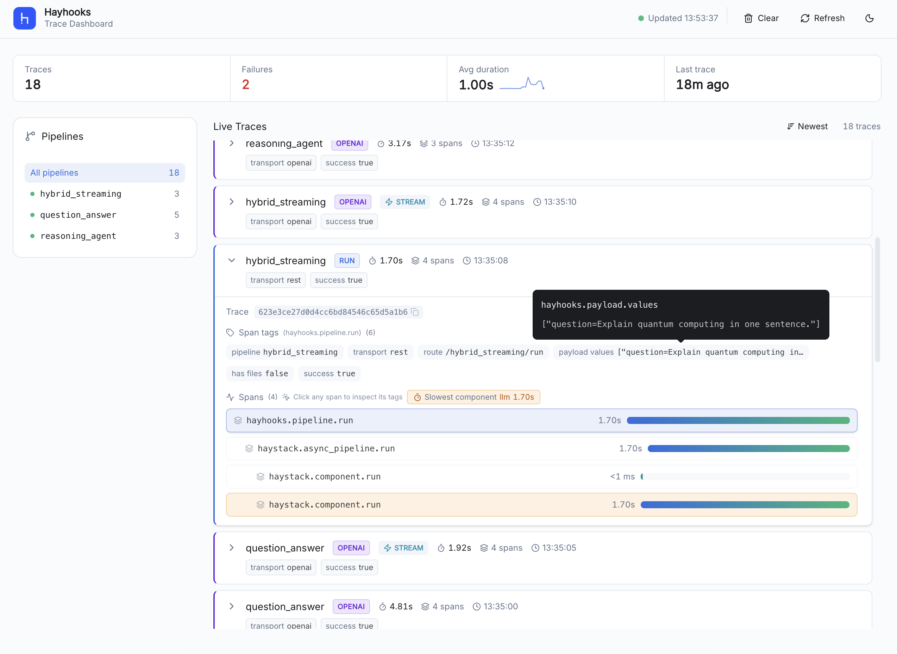
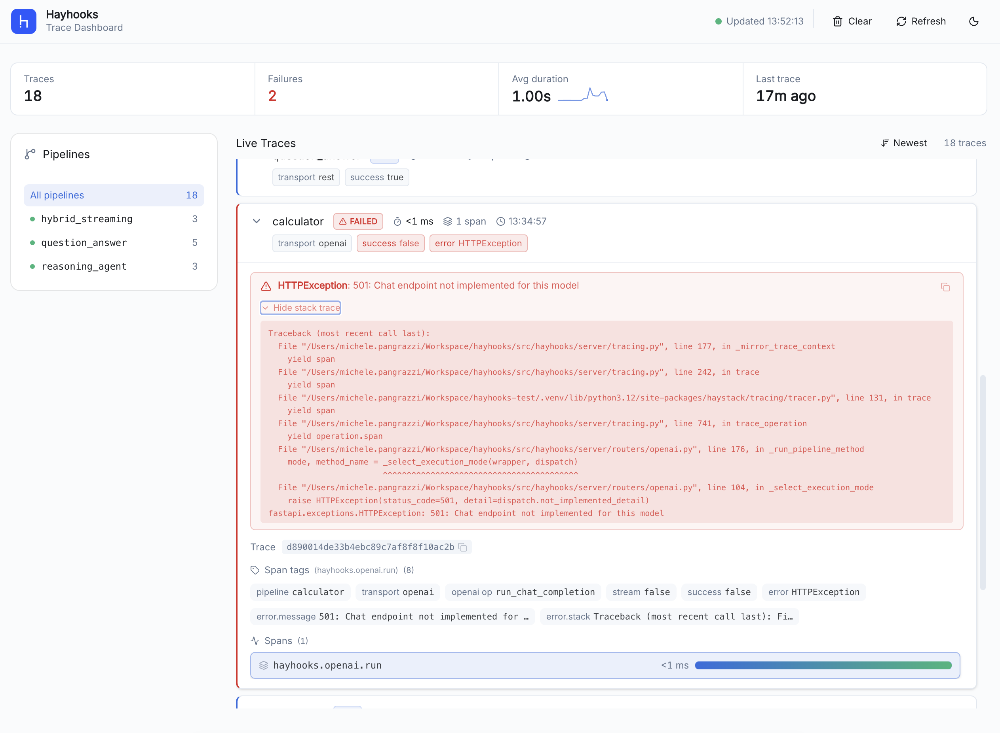

# Tracing

Hayhooks tracing builds on Haystack tracing APIs and standard OpenTelemetry configuration.

## Install

Install tracing extras first:

```bash
pip install "hayhooks[tracing]"
```

This installs the OpenTelemetry SDK, OTLP exporters, and FastAPI/Starlette instrumentors used by Hayhooks.
Dashboard frontend source files are bundled in Hayhooks wheels for local runtime builds.

## Quick Start (OTLP)

Set OpenTelemetry environment variables, then run Hayhooks:

```bash
export OTEL_SERVICE_NAME=hayhooks
export OTEL_EXPORTER_OTLP_ENDPOINT=http://localhost:4318
export OTEL_EXPORTER_OTLP_PROTOCOL=http/protobuf
export OTEL_TRACES_SAMPLER=parentbased_traceidratio
export OTEL_TRACES_SAMPLER_ARG=1.0
export HAYHOOKS_TRACING_EXCLUDED_SPANS='["send", "receive"]'

hayhooks run
```

!!! tip "Using OTEL_EXPORTER_OTLP_TRACES_ENDPOINT"
    If you set `OTEL_EXPORTER_OTLP_TRACES_ENDPOINT` directly for HTTP transport, use the full traces path
    (for example `http://localhost:4318/v1/traces`).

## Local Backends

### SigNoz

Start SigNoz locally:

```bash
git clone -b main https://github.com/SigNoz/signoz.git
cd signoz/deploy/docker
docker compose up -d --remove-orphans
```

Open SigNoz at `http://localhost:8080`, then go to **Traces** and filter by service `hayhooks`.

### Jaeger

If you want a lighter single-container setup:

```bash
docker run --rm -d \
  --name jaeger \
  -e COLLECTOR_OTLP_ENABLED=true \
  -p 16686:16686 \
  -p 4318:4318 \
  jaegertracing/all-in-one:latest
```

Open Jaeger at `http://localhost:16686` and use the same `OTEL_*` variables shown above.

## Live Dashboard

Hayhooks includes a built-in trace dashboard at `/dashboard` that provides real-time visibility into pipeline operations.



### Features

- **Live trace feed** — auto-refreshes (default every 2.5s, configurable via `HAYHOOKS_DASHBOARD_UI_POLL_MS`) with new-trace animations.
- **Pipeline filter** — click a pipeline in the sidebar to filter traces; counts update per pipeline.
- **Span waterfall** — expand any trace to see nested spans with duration bars and per-span pipeline badges.
- **Slowest component signal** — highlights only the single slowest component span per trace when its duration is above the configured threshold.
- **Kind badges** — each trace shows a kind badge (run, openai, deploy, undeploy, mcp) for at-a-glance classification.
- **Streaming indicator** — streaming requests get a visible STREAM badge beside the kind badge.
- **Summary tags** — collapsed cards show transport and success/error status; expanded view shows all tags with tooltips and a copyable trace ID.
- **Error detail** — failed traces display error type, message, and an expandable/copyable stack trace.
- **Sort** — toggle between newest-first and slowest-first ordering.
- **Stats** — pipeline trace count, failure count, average duration with sparkline, and last-trace time, all reflecting the active filter.
- **Dark mode** — toggle between light and dark themes via the header button.
- **Clear traces** — wipe the local trace buffer from the header.

### Error Traces

When a pipeline request fails, the dashboard highlights the affected trace with a red left border and a **failed** badge in place of the kind badge. Expand the trace to see:

- **Error type and message** — shown at the top of the detail area in the error block.
- **Stack trace** — expandable section with a copy button for sharing or debugging.



### Setup

Enable and run the dashboard from CLI:

```bash
hayhooks run --with-tracing-dashboard
```

The `--with-tracing-dashboard` flag enables dashboard mounting and builds the frontend at runtime from the
packaged dashboard source files.

To build the frontend at runtime, Node.js/npm must be available on the machine.

If you prefer configuring via environment variables instead of CLI flags:

```bash
export HAYHOOKS_DASHBOARD_ENABLED=true
cd dashboard
npm install
npm run build
export HAYHOOKS_DASHBOARD_DIST_DIR=./dashboard/dist
hayhooks run
```

For frontend-specific workflows (local Vite dev server, lint/test/build commands), see the
[dashboard frontend README](https://github.com/deepset-ai/hayhooks/blob/main/dashboard/README.md).

### Trace Source

The dashboard always reads traces from Hayhooks' in-process live trace buffer.

- No dashboard-side Jaeger/SigNoz fetching is used.
- No extra dashboard backend mode configuration is required.
- You can still export traces to external backends via standard `OTEL_*` variables for observability tooling,
  while the dashboard remains a local live view.
- The in-memory buffer is capped (default: `200` traces). Configure retention size with:

```bash
export HAYHOOKS_DASHBOARD_TRACE_BUFFER_CAPACITY=2000
```

!!! warning "Dashboard with multiple workers"
    Dashboard traces are stored in each worker process memory. If you run Hayhooks with multiple workers
    (for example `hayhooks run --workers 2`), each worker keeps a separate trace buffer.
    The dashboard may show only a subset of traces, and `POST /dashboard/api/traces/clear` only clears the
    worker that served that request.
    For a consistent dashboard view, run with a single worker (`--workers 1`).

### Dashboard Tuning

The dashboard UI behaviour is configurable via environment variables (`HAYHOOKS_DASHBOARD_UI_*`).
All values are fetched by the frontend at page load from the `/dashboard/api/config` endpoint.

| Variable | Default | Description |
| --- | ---: | --- |
| `HAYHOOKS_DASHBOARD_UI_POLL_MS` | `2500` | Polling interval (ms) between trace list refreshes |
| `HAYHOOKS_DASHBOARD_UI_LIST_CAP` | `100` | Max traces kept in the browser list |
| `HAYHOOKS_DASHBOARD_UI_FETCH_LIMIT` | `50` | Traces requested per poll |
| `HAYHOOKS_DASHBOARD_UI_FRESH_MS` | `6000` | Duration (ms) a new trace keeps the "NEW" highlight |
| `HAYHOOKS_DASHBOARD_UI_SLOW_COMPONENT_MIN_DURATION_MS` | `1000` | Threshold (ms) to flag the slowest component |

For the full list of dashboard and tracing settings, see the
[environment variables reference](environment-variables.md).

#### Haystack component spans

By default, the dashboard includes both Hayhooks operation spans (deploy/run/openai/mcp lifecycle) **and**
Haystack component spans in the same trace trees. To show only Hayhooks operation spans, disable:

```bash
export HAYHOOKS_DASHBOARD_TRACE_INCLUDE_HAYSTACK_SPANS=false
```

This feature flag only affects what gets mirrored into the dashboard buffer; it does not change
dashboard UI filtering/sorting behavior.
It also works without configuring an external tracing backend (local capture mode).

Run Hayhooks and open `http://localhost:1416/dashboard`.

A demo script is available to generate representative traces across multiple pipelines:

```bash
bash scripts/demo_dashboard_traces.sh
```

The script deploys example pipelines, fires REST and OpenAI-compatible streaming/non-streaming requests, then
undeploys — producing a mix of trace kinds, success/failure states, and streaming indicators for exploring
the dashboard UI.

### API Endpoints

| Endpoint | Method | Description |
| --- | --- | --- |
| `/dashboard/api/config` | GET | Fetch dashboard UI polling/list settings |
| `/dashboard/api/entrypoints` | GET | List deployed pipeline names |
| `/dashboard/api/traces` | GET | Fetch recent traces (supports `limit` and `since_ms` query params) |
| `/dashboard/api/traces/clear` | POST | Clear the local trace buffer |

## Notes

- Hayhooks does not define a custom `HAYHOOKS_OTEL_*` exporter namespace. Use standard OpenTelemetry `OTEL_*` variables.
- `HAYHOOKS_TRACING_EXCLUDED_SPANS` is a Hayhooks-specific instrumentation tuning option for framework span noise.
- When `OTEL_EXPORTER_OTLP_ENDPOINT` (or `OTEL_EXPORTER_OTLP_TRACES_ENDPOINT`) is set, Hayhooks attempts automatic OTLP bootstrap at startup using `OTEL_EXPORTER_OTLP_TRACES_PROTOCOL` (fallback: `OTEL_EXPORTER_OTLP_PROTOCOL`, default `http/protobuf`).
- For advanced setups, you can initialize your own OpenTelemetry tracer provider before importing Hayhooks/Haystack.

## Next Steps

- [Environment Variables](environment-variables.md)
- [Logging](logging.md)
