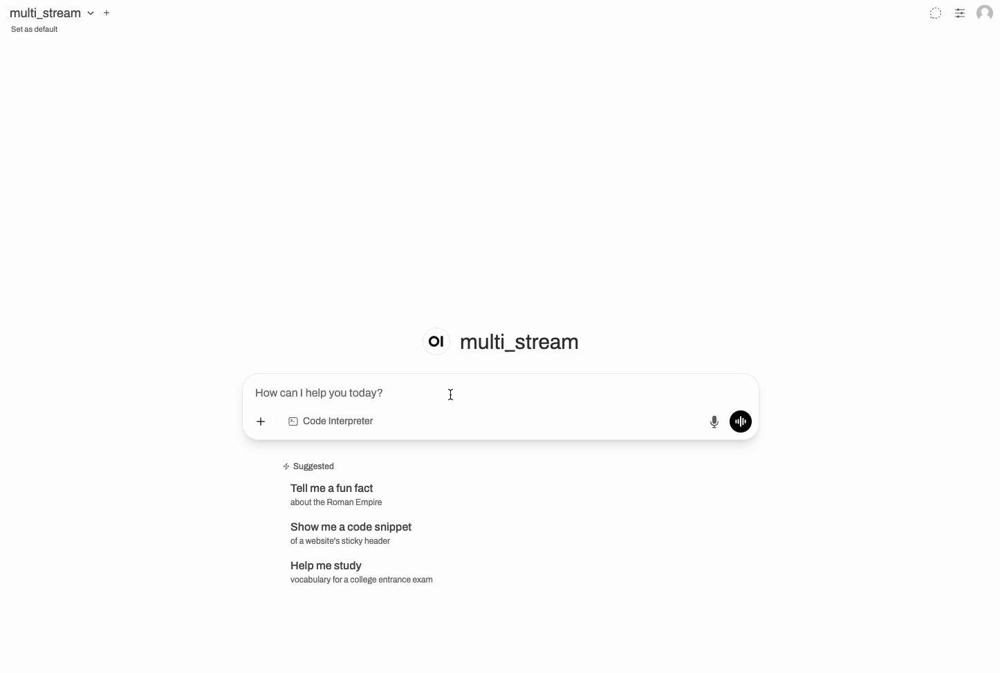

# Multi-LLM Streaming Example

This example demonstrates hayhooks' configurable multi-component streaming support.

## Overview

The pipeline contains **two LLM components in sequence**:

1. **LLM 1** (`gpt-5-nano` with `reasoning_effort: low`): Provides a short, concise initial answer to the user's question
2. **LLM 2** (`gpt-5-nano` with `reasoning_effort: medium`): Refines and expands the answer into a detailed, professional response

This example uses `streaming_components` to enable streaming for **both** LLMs. By default, only the last component would stream.



## How It Works

### Streaming Configuration

By default, hayhooks streams only the **last** streaming-capable component (in this case, LLM 2). However, this example demonstrates using the `streaming_components` parameter to enable streaming for both components:

```python
streaming_generator(
    pipeline=self.pipeline,
    pipeline_run_args={...},
    streaming_components=["llm_1", "llm_2"]  # or streaming_components="all"
)
```

**Available options:**

- **Default behavior** (no `streaming_components` or `None`): Only the last streaming component streams
- **Stream all components**: `streaming_components=["llm_1", "llm_2"]` (same as `streaming_components="all"`)
- **Stream only first**: `streaming_components=["llm_1"]`
- **Stream only last** (same as default): `streaming_components=["llm_2"]`

### Pipeline Architecture

The pipeline connects LLM 1's replies directly to the second prompt builder. Using Jinja2 template syntax, the second prompt builder can access the `ChatMessage` attributes directly: `{{previous_response[0].text}}`. This approach is simple and doesn't require any custom extraction components.

This example also demonstrates injecting a visual separator (`**[LLM 2 - Refining the response]**`) between the two LLM outputs using `StreamingChunk.component_info` to detect component transitions.

## Usage

### Deploy with Hayhooks

```bash
# Set your OpenAI API key
export OPENAI_API_KEY=your_api_key_here

# Deploy the pipeline
hayhooks deploy examples/pipeline_wrappers/multi_llm_streaming

# Test it via OpenAI-compatible API
curl -X POST http://localhost:1416/v1/chat/completions \
  -H "Content-Type: application/json" \
  -d '{
    "model": "multi_llm_streaming",
    "messages": [{"role": "user", "content": "What is machine learning?"}],
    "stream": true
  }'
```

### Use Directly in Code

```python
from haystack import Pipeline
from haystack.components.builders import ChatPromptBuilder
from haystack.dataclasses import ChatMessage
from hayhooks import streaming_generator

# Create your pipeline with multiple streaming components
pipeline = Pipeline()
# ... add LLM 1 and prompt_builder_1 ...

# Add second prompt builder that accesses ChatMessage attributes via Jinja2
pipeline.add_component(
    "prompt_builder_2",
    ChatPromptBuilder(
        template=[
            ChatMessage.from_system("You are a helpful assistant."),
            ChatMessage.from_user("Previous: {{previous_response[0].text}}\n\nRefine this.")
        ]
    )
)
# ... add LLM 2 ...

# Connect: LLM 1 replies directly to prompt_builder_2
pipeline.connect("llm_1.replies", "prompt_builder_2.previous_response")

# Enable streaming for both LLMs (by default, only the last would stream)
for chunk in streaming_generator(
    pipeline=pipeline,
    pipeline_run_args={"prompt_builder_1": {"query": "Your question"}},
    streaming_components=["llm_1", "llm_2"]  # Stream both components
):
    print(chunk.content, end="", flush=True)
```

## Integration with OpenWebUI

This pipeline works seamlessly with OpenWebUI:

1. Configure OpenWebUI to connect to hayhooks (see [OpenWebUI Integration docs](https://deepset-ai.github.io/hayhooks/features/openwebui-integration))
2. Deploy this pipeline
3. Select it as a model in OpenWebUI
4. Watch both LLMs stream their responses in real-time
